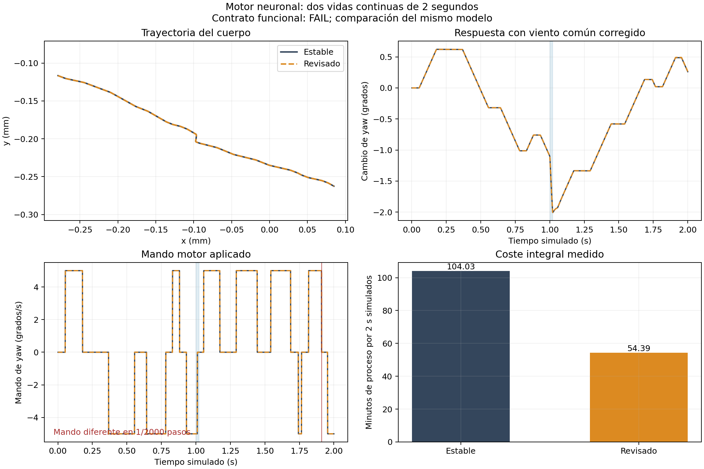

# Resultado de la revisión integral y comparación de 2 segundos

**PROMETEDOR_NO_CONFIRMADO**, para la condición indicada. Resultado del verificador
funcional: **FAIL**; identidad de ejecución: **PASS_RUNTIME_CONTRACT**.
Fallos del contrato: ['same_applied_yaw_each_tick']. No se afirma equivalencia neurobiológica
general ni mejora de navegación por cambiar el integrador. La corrida negativa
se conserva: no se modificaron criterios ni fuentes para convertirla en PASS.

| Medición | Estable | Motor revisado |
|---|---:|---:|
| Vida simulada | 2.000 ms continuos | 2.000 ms continuos |
| Avance del organismo (s) | 6119.690 | 3127.421 |
| Proceso completo (min) | 104.032 | 54.389 |
| Minutos de proceso por segundo simulado | 52.016 | 27.195 |

Aceleración integral medida: **1.913×**;
aceleración del avance: **1.957×**. Es una pareja local,
con orden estable→revisado, no un intervalo estadístico sobre múltiples máquinas.

Meta solicitada: 12–20 minutos por segundo simulado, con holgura hasta 25.
El coste integral de esta pareja es **27.195 min/s**:
queda por encima del objetivo y de la holgura de 25 min/s. La fidelidad funcional y esta meta de rendimiento se
informan por separado; no se cambian los criterios para convertir una en otra.

9/35 campos de la traza son exactos. Igualdad exacta de
configuración corporal (`qpos`): False; velocidad: False;
mando yaw: False; mando forward:
True; contactos: True.
Los criterios completos y todas las discrepancias están en `PAIR2000.json`.

Pasos con mando de yaw diferente: **[1911]**. Error máximo de posición:
2.9103273e-05 mm; error máximo de yaw:
0.0049999411 grados. Las diferencias de posición y yaw cumplen
sus límites, pero no sustituyen la exigencia congelada de mando idéntico en
cada paso. No se promueve automáticamente el motor por ser más rápido.

Eventos comprometidos: 103821 estable y
103821 revisado; bloques con identidades diferentes:
12. Los predictores descartados
se informan por separado; los payloads y tiempos no se declaran exactos cuando
no lo son. El informe conserva las exclusiones de emparejamiento.

Se corrigieron tres mecanismos concretos: dependencia inicial de streams PN,
extremo canónico de eventos RK y mapa del torque con la pose actual. Se revisaron
código, matemáticas, datos y hardware antes del ensayo. Las pruebas CPU/GPU
dirigidas, el diagnóstico real de20ms y la pareja100ms precedieron esta vida.
La referencia histórica con reinicio frío se conservó como antecedente; se
ejecutó una nueva referencia continua con la misma corrección física.

La revisión y oportunidades justificadas están en `REVISION_INTEGRAL.md` y los
informes de `reviews/`. Se conserva el modelo y su acoplamiento: control local de
error y coincidencia funcional no demuestran convergencia global del sistema.
PN629 general y plasticidad siguen apagados según la preparación; el cuerpo usa
su prótesis de contacto. Este ensayo no demuestra vuelo.

Las fuentes, parámetros y criterios permanecieron congelados desde antes de
los100ms. El complemento externo `check_runtime.py` cierra una omisión del
verificador original —comprobar el ejecutor realmente instalado— sin cambiar
umbrales ni repetir vidas. Los snapshots finales guardan propietarios científicos
y memoria motora con `restart_tested=false`: todavía no certifican un reinicio
genérico del organismo entre procesos.
