# Revisión integral del motor neuronal — ronda 12

Se revisó la ruta que ejecuta el organismo real, sus dependencias y antecedentes
del 24–25 de septiembre. Cierre: 26-09-2026. La pareja de 2 segundos está completa;
su contrato funcional dio FAIL por un mando de giro distinto. Es una revisión delimitada de implementación y modelo,
no una garantía de ausencia de todo defecto ni validación neurobiológica.

## Recorrido que efectivamente se ejecuta

```mermaid
flowchart LR
    A[MaleCNS canónico y parámetros] --> B[Checkpoint preparado y operador efectivo]
    B --> C[Sensores pendientes del paso anterior]
    C --> D[Acoplamiento de 125 microsegundos]
    D --> F[Células y CNS: predictor de media época]
    F --> G[Restauración del predictor]
    G --> E[PN: primera media época]
    E --> H[Células y CNS: época comprometida]
    H --> I[PN: segunda media época y publicación]
    I --> J[DN con demora de 1 ms y memoria del filtro motor]
    J --> K[Cuerpo: 40 subpasos de 25 microsegundos]
    K --> L[Sensores para el próximo milisegundo]
    L --> C
```

El diagrama resume propietarios y demoras; el orden interno preciso de las dos
medias épocas PN queda en `block_midpoint.py`. La red no avanza todos sus
componentes mediante un único paso uniforme. Los eventos predictivos descartados
se registran separados de los comprometidos.

La carga conserva IDs y orientación post→pre del CSR, pero anatomía, pesos
almacenados, pesos efectivos y salidas sustituidas por cada propietario son
objetos distintos. Regenerar los pesos desde los conteos borraría historia e
intervenciones. La preparación se compara directamente en cinco árboles antes
de permitir el primer paso. La captura de fuentes incluye módulos dinámicos,
kernels y los archivos de entrada del campo y del checkpoint.

## Hallazgos materiales y efecto retroactivo

| Hallazgo | Reparación y alcance |
|---|---|
| Dos constructores PN inicializaban buffers en un stream y los leían en otro no bloqueante sin dependencia explícita | Esperar al productor una vez durante setup, antes de la primera lectura. Mismo solver y mismos datos. La ausencia de un fallo en la vida anterior no demostraba ausencia de carrera. |
| RK3 reconstruía el extremo del evento mediante una suma redondeada | Usar un extremo canónico compartido por proyección derecha, evaluación izquierda y compromiso. Contraejemplo fabricado a partir de marcas reales; no se afirma que todos los pares susceptibles hubieran causado fallos en 11. |
| `mj_applyFT` utilizaba cinemática fría al reiniciar y atrasada tras integrar | Calcular sólo cinemática y centros en datos auxiliares con la pose actual; preservar contactos, calentamiento numérico y estado del cuerpo real. El primer viento histórico fue cero; esta corrección cambia explícitamente el protocolo físico común. |
| Los locks anteriores no cubrían todos los módulos PN e inputs del ensayo | Inventario de ejecución con módulos dinámicos, fuentes nativas y entradas científicas; verificación antes y después. No confundir un hash parcial con cierre transitivo. |

La implementación está en copias de esta ronda. Los originales estables, 07 y
11, sus resultados y sus hipótesis quedan intactos. El estable conserva su
integrador; ambos brazos reciben la reparación PN y el mismo viento corregido.

## Evidencia previa a una vida larga

- [CUDA y propietarios](reviews/CUDA.md): memoria, captura, streams, escritores,
  invalidación, rollback, capacidades, FP32 y hardware.
- [Matemática](reviews/math/MATH.md): ecuaciones, masa, RK3(2), error, eventos,
  extremos, aceptación/rechazo, acoplamiento y alcance del control estable.
- [Dataset](reviews/DATASET.md): procedencia, IDs, CSR, signos, fronteras,
  componentes, grados, recurrencia, unidades, tiempos e hipótesis fisiológicas.
- Prueba física CPU: 40 subpasos calientes frente a restaurados, con fuerza,
  contactos y estado de integración exactos. El mapa mínimo coincide también
  con un cálculo independiente mediante `mj_fwdPosition`.
- Pruebas del contrato temporal: código real extraído y compilado en CPU, y
  tres sistemas proyectados ejecutados en GPU. El extremo derecho incluye el
  evento y el izquierdo lo excluye; la aceptación conserva el control de error.
- Diagnóstico real de 20 ms: terminó y conservó los 35 campos de la traza frente
  a 11. Es una comprobación de integración, no la confirmación de dos segundos.

## Qué significa entender este cerebro para el motor

Son 166.700 nodos canónicos MaleCNS v1.0 y 25.582.938 pares agregados internos,
no 25,58 millones de contactos individuales. El componente fuertemente conexo
mayor del soporte efectivo abarca el 97,12 %: los vecinos directos pequeños no
garantizan independencia dinámica. Además, señales graduadas continúan sin
espigas. Por ello, `event_sparse` no permite omitir la mayor parte del CNS sin
otro control de influencia y error.

PN629 designa 629 consumidores generales de una PN física, y ese reemplazo
general está apagado en este ensayo; permanecen 466 consumidores eléctricos
especializados. La plasticidad está deshabilitada, aunque hay historia guardada.
La frontera anatómica, signos de neurotransmisor, normalización morfométrica y
cinéticas contienen hipótesis. Los tiempos de la dinámica no vienen del archivo
de conectividad. Estos límites se conservan iguales entre motores, sin tratar
la comparación numérica como validación de todas esas hipótesis.

## Deuda y oportunidades que no frenan esta confirmación

El adaptador todavía instala métodos sobre clases heredadas y acepta un dueño
por proceso. Es una deuda de interfaz para una biblioteca general; no un motivo
para reescribirla antes de esta comparación. Una API futura debe declarar
lectores, escritores, unidades, relojes, versiones de buffers y reglas de
invalidación, especialmente cuando cambia topología o parámetros capturados.

Las 16.984 conversiones completas observadas en la vida de 1 s justifican medir
su coste y el de los intercambios/restauraciones. No prueban que dominen el
tiempo: un perfil Python de operaciones CUDA asíncronas mide principalmente
encolado. El próximo cambio de fondo preferente es coordinación y estado
residentes con versiones de escritura, condicionado a un perfil disjunto de
transferencias, sincronización, cómputo y publicación. No eliminar refrescos sin
cerrar los escritores que restauran pesos.

La integración implícita/Krylov y los métodos por influencia conservan interés
como alternativas, pero requieren un operador efectivo y una prueba de ahorro
frente al coste de corrección. Los ensayos previos con RHS congelado y eventos
tardíos siguen siendo negativos. No se incorpora matemática por novedad ni se
fusionan prototipos que resolvían subproblemas diferentes.

## Comparación autorizada

Dos vidas continuas de 2.000 ms desde la misma preparación, una estable y otra
revisada, sin reinicio en 1.000 ms. Antes, pareja de 100 ms y criterios de
`PLAN.json`. Viento en pasos 1001–1020: 800 contribuciones cartesianas iguales,
no nulas, mapeadas con la pose de cada subpaso. Se verifican trayectoria,
mandos, contactos, relojes, estados neuronales/PN y eventos, además del tiempo.
Una ganancia de velocidad no autoriza a afirmar mejor navegación.

## Resultado de la confirmación y decisión

[Informe generado](RESULTADOS.md), [datos comparados](PAIR2000.json) e
[identidad del runtime](RUNTIME_PAIR2000.json). Ambos procesos terminaron dentro
de presupuesto. Estable: 6.241,904 s; revisado: 3.263,368 s; ahorro integral
47,72 %. El coste revisado es 27,195 minutos por segundo simulado, por encima
de los objetivos de 20 y 25 minutos. No se cambia la meta por este resultado.

La única puerta funcional que falla es mando yaw idéntico en cada milisegundo.
En el paso 1911 el estable apaga el giro y el revisado lo sostiene 1 ms más.
El filtro está a ambos lados de su umbral de 0,0005 rad/s. La revisión no
autoral reconstruyó exactamente las fórmulas del decodificador desde las
señales DN guardadas en ambos brazos: la discrepancia inmediata procede de
una decisión discontinua sobre trayectorias neuronales distintas, no de una
implementación distinta del filtro. Esto no identifica por sí solo cuánto
aporta FP32, cuánto el integrador, ni cuál trayectoria es más fiel.

La posición y yaw permanecen dentro de sus límites; la diferencia máxima de
yaw es 0,00499994 grados. Forward y contactos son exactos. Hay 103.821 eventos
comprometidos en cada brazo, con el mismo multiconjunto global y diferencias
de pertenencia temporal en 12 bloques; los predictores descartados difieren
en un evento total y se conservan separados. Los estados internos y la
trayectoria completa no son idénticos.

Se conserva la base y las tres reparaciones como trabajo útil. Clasificación:
**PROMETEDOR_NO_CONFIRMADO**; no promoción automática como sustituto exacto del
estable. El siguiente trabajo de fidelidad debe definir un contrato explícito
entre incertidumbre numérica y decisiones con umbral, manteniendo el FAIL
actual. No endurecer tolerancias a ciegas, retocar el umbral ni cambiar el
decodificador para rescatar esta vida. Una comparación futura debe fijar antes
su criterio y separar fidelidad funcional de identidad de comandos. El trabajo
de rendimiento sigue condicionado a atribuir coste real de sincronización,
transferencias y propietarios, antes de introducir otra arquitectura.

Termina la ronda: cero nuevas vidas tras esta confirmación. Los snapshots
finales preservan el estado científico, pero no certifican reanudación entre
procesos. El paquete reconstruye evidencia guardada en CPU; no se presenta
esa comprobación como una nueva ejecución del organismo.
