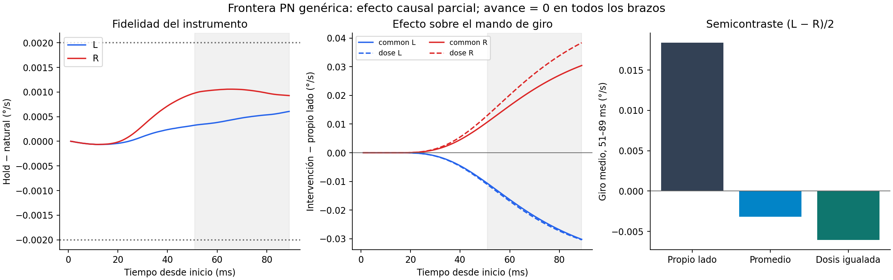

# PN genérica: contribución causal parcial; etapas 4/5 abiertas

La intervención en la salida PN→CSR genérica cambió materialmente el pequeño contraste izquierda/derecha del mando de giro bajo el criterio congelado. El efecto también aparece al igualar la cantidad total interna de señal. **Todos los brazos siguen girando en el mismo sentido y el mando de avance continúa en cero.** No se consiguió navegación ni recuperación ante viento.

Éste es un resultado local de atribución causal en una preparación expuesta. No identifica un código direccional biológico, predominio ni necesidad de toda la salida PN. Las rutas PN especializadas permanecieron vivas y pueden interactuar con la vía manipulada. [Decisión y siguientes alternativas](DECISION.md).

## Datos reconstruidos

Ventana fijada antes del ensayo: 51–89 ms desde el inicio; el estímulo comienza tras el prefijo de 10 ms. L/R identifica el lado de la fuente. `self` mantiene cada primera muestra PN durante 1 ms; `common` usa el promedio L/R; `dose` ajusta ese promedio para conservar el total `caps*q` del lado original. Este último total pertenece al modelo y no es corriente física.

| Brazo | Giro medio °/s | Avance medio mm/s |
|---|---:|---:|
| self_L | 2.828189 | 0.000000 |
| self_R | 2.791423 | 0.000000 |
| common_L | 2.806684 | 0.000000 |
| common_R | 2.813045 | 0.000000 |
| dose_L | 2.806230 | 0.000000 |
| dose_R | 2.818310 | 0.000000 |

El semicontraste (L−R)/2 pasa de 0.018383352 °/s a -0.003180091 con el promedio y -0.006040022 con dosis igualada. Los cambios respecto a `self` son −0,021505/+0,021622 °/s y −0,021959/+0,026887 °/s, respectivamente. Se cumplen los signos y mínimos previamente registrados: 0,005 °/s por lado y 0,01 °/s de reducción del semicontraste. No se interpreta como «más del 100 % de mediación» ni se calculan intervalos poblacionales con una sola preparación.



[Cifras completas generadas desde arrays](RESULTADOS.json) · [localización/hash de la lectura verificada](RAW_POINTER.json) · [contrato congelado](../../config/pn_frontier_trial_57.json) · [recibo de congelación](FROZEN_TRIAL.json).

## Qué se comprobó antes de atribuir el efecto

- El preflight descartó `p0±d`: dos coordenadas PN salen del dominio. Los resúmenes first/last/min/max/count de 57 no permiten reconstruir una cinta RHS exacta. Se preservó ese negativo; no hubo clipping ni eliminación de neuronas.
- El escritor identidad reprodujo exactamente los campos retenidos del padre y el consumo PN durante 12 ms, por lado. Eso no equivale a identidad de todo el cerebro durante 89 ms.
- El hold de 1 ms pasó el control frente a la referencia natural: error máximo de giro 0,000606/0,001058 °/s, frente al límite 0,002; error DNb consumido 7,24e−7/1,23e−6 q, frente a 1,6e−6. El avance fue idéntico.
- La lectura CPU declara los 57 archivos de entrada y reconstruye el mando desde el estado descendente realmente consumido, con su fase de 1 ms. Verifica el escritor antes/después y su cobertura, las identidades, relojes, dominio, dosis y criterios. Detecta corrupción de fase, señal y criterio incluso con Python optimizado.
- La comparación inicial de adquisición descubre trazas vecinas del recibo. Por ello la conclusión se basa en la receta adicional de entradas explícitas, no en esa comparación aislada. El ciclo retrospectivo reutilizó la lectura verificada: cero CNS adicional.

No se cambiaron pesos, leyes, umbrales ni ganancias. Los ocho brazos partieron del mismo estado 48/sham. No son ocho organismos independientes. El ensayo fue diseñado con información histórica ya expuesta.

## Asesores y límites

Motor C++/CUDA reconstruyó los contrastes desde NumPy sin importar nuestro verificador; sus [datos de revisión](aporte_motor/VERIFICACION_FINAL.json) conservan el alcance. ChatGPT ASTRA_V2 y ChatGPT_Motor_V2 revisaron la propuesta y la interpretación conceptual; no inspeccionaron estos arrays ni se verificó modo PRO. Ambos priorizan después los operandos/contexto efectivo de DNg100. Sus objeciones sobre intervención sintética y rutas paralelas se incorporan al alcance del resultado.

Jev evaluó un lote de seis alternativas: asignó la misma categoría de repetición a todas, con confianza alta. El lote no discriminó opciones y no se usó para elegir ni validar. Se conserva como límite observado de esa configuración, sin pedir nuevas clasificaciones hasta cambiar la pregunta o validar el instrumento. [Recibo](jev_01/receipt.json).

La inspección exploratoria de DNg100 encontró objetivo final cero y márgenes negativos en todas las evaluaciones RHS guardadas. [Envolventes](DNG_ENVELOPES.json) incluye también evaluaciones predictoras/rechazadas: no es una trayectoria media ni una descomposición causal por tipo celular. No sustituye el próximo análisis de contexto.

## Coste, reutilización y cierre

Se ejecutaron 558 ms nuevos de CNS en ocho procesos: 1310.56 s de CPU de trabajadores y 1250.72 s de pared desde el primer brazo hasta la comparación. Límites previos: 600 ms, 2400 s CPU y 3600 s de pared. [Costes](COSTES.json). Las consultas manuales no tienen contabilidad agregada completa. No hubo repetición CNS por fallos de informe o indexación.

El workflow causal excedía el máximo administrativo de 1800 s de `cycle`; se ejecutó la receta con el límite externo de 3600 s ya declarado. No se alteró el límite del framework. La decisión posterior `78bef0fef38d4b76b926e1be407f34ef` es una lectura retrospectiva de los mismos criterios, explícitamente expuesta. [Recibo](readback_cycle.json). La alternativa de plantillas constantes estaba condicionada al fallo de fidelidad; como la fidelidad pasó, no se ejecutó.

```bash
cd /home/daroch/AXIOMA_FLYWIRE/matrix
./matrix workbench run pn-frontier-readback
./matrix workbench cycle show 78bef0fef38d4b76b926e1be407f34ef
./matrix lab show work/pn_frontier_causal_20260928
```

El primer comando sólo lee datos y reutiliza resultados si sus fuentes e inputs conservan identidad. No relanzar `pn-frontier-trial` para consultar resultados: cambiar el código del laboratorio puede invalidar legítimamente una caché histórica aunque sus arrays sigan siendo evidencia.

Motivo de parada: hito causal acotado terminado, revisión y entrega. No se consume la reserva restante buscando movimiento. La ronda reduce incertidumbre causal, pero **el progreso conductual sigue pendiente**. El siguiente trabajo debe discriminar un mecanismo diferente, con antecedentes y presupuesto propios.

La primera extracción limpia detectó una omisión de portabilidad: la CLI no fijaba los hilos BLAS que sí fijaban adquisición y workbench. Cambiaba el orden de reducción y fallaba la identidad exacta del control de dosis. Se conservan la entrega inicial y el fallo. La CLI corregida fija un hilo antes de importar NumPy; no cambian estímulos, arrays, criterios ni tolerancias, y sólo se repite la lectura CPU. [Incidencia y alcance](PORTABILITY_FIX.json).
