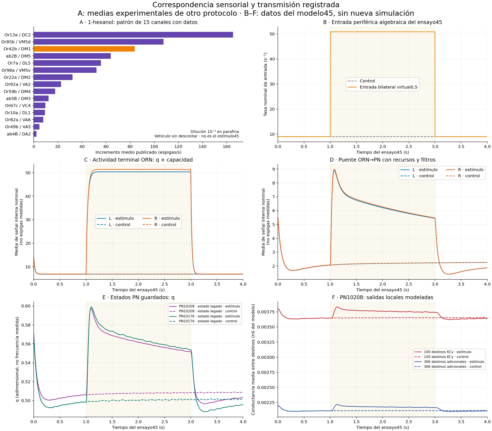

# Correspondencia sensorial después de47

**Hito completado: extracción de un perfil experimental identificable y reconstrucción de la transmisión guardada en45. La transferencia ORN→PN todavía no está calibrada fisiológicamente.** Se conservaron el motor, sus parámetros y las etapas4/5 abiertas. No hubo nueva integración neuronal o física.

## Resultado que cambia la próxima decisión

El estímulo45 fue una entrada virtual bilateral y selectiva para DM1, de amplitud0,5 entre1–3s. No es una exposición identificada a una sustancia química ni una prueba general de que el cerebro no pueda responder a olores.

La fórmula periférica `9 + 83,667 × u` procede de dos medias de Or42b del estudio de de Bruyne2001, recogidas en DoOR: basal9espigas/s e incremento83,667espigas/s ante1-hexanol, preparado a10⁻² en aceite de parafina. El vehículo no se descontó. El valor92,667 es una reconstrucción aproximada usando medias; no es un pico ni una observación de cada neurona. La interpolaciónu=0,5 produce50,8335s⁻¹ nominales, pero no identifica una concentración física. Tampoco las medias fijan una respuesta temporal de2s.

Se recuperó **la misma columna de estudio, Bruyne.2001.WT**, sin mezclar valores normalizados ni estudios: hay15 canales con basal e incremento disponibles. Los15 tienen incrementos positivos en esta tabla y corresponden por etiqueta glomerular a772ORN del conectoma local. DM1 comprende74 de ellas. Los otros14 canales carecen de una entrada periférica química directa en45; esto **no** significa que sus neuronas se eliminaran o no recibieran actividad recurrente. Las correspondencias por tipo son hipótesis de transferencia entre preparaciones, no mediciones individuales de esas772células.

[Perfil extraído](PERFIL_1_HEXANOL.csv) · [Procedencia DoOR](DOOR_EXTRACTION.json) · [Publicación original](https://doi.org/10.1016/S0896-6273(01)00289-6) · [DoOR v2.0.1](https://github.com/ropensci/DoOR.data/tree/v2.0.1).

La novedad de esta lectura es hacer explícito y cuantificar ese patrón en relación con45. La limitación de la periferia ya estaba documentada el13-09; no se presenta como un descubrimiento fisiológico nuevo. **45 conserva su interpretación como estimulación virtual selectiva; no se reetiqueta retrospectivamente como1-hexanol.** Tampoco se afirma que1-hexanol, a esa dilución, deba iniciar marcha o atraer al animal.

## Qué transmitió el modelo

Se releen los80bloques de las dos vidas45, de4s cada una. La comparación siguiente usa la misma ventana2501–3000ms en ambos brazos; es descriptiva y no convierte muestras temporales en animales independientes.

| Observable guardado o reconstruido | Izquierda: olor/control | Derecha: olor/control |
|---|---:|---:|
| ORN terminal, media de `q × capacidad` | 7,366× | 7,449× |
| Puente ORN→PN, media de los filtros ponderados | 2,528× | 2,532× |

La salida local de PN10208 hacia100KCγ aumenta2,588% en media; hacia366destinos adicionales,2,503%. Son **conductancias del modelo** y medias entre destinos. El estado legadoq de las dosPN también cambia, pero no equivale a frecuencia de espigas ni a liberación local de PN10208.

Las columnas anteriores tienen escalas y operaciones diferentes. Sus cocientes **no son un presupuesto de energía ni porcentajes de señal conservada**. Recursos, filtros, otras entradas y la ley postsináptica participan en el resultado. No se atribuye causalmente toda la diferencia a una sola sinapsis ni se demuestra un defecto de la ley. Las muestras son endpoints: no reconstruyen todos los operandos intermedios que consumió el integrador.

El campo `PN_general_transmission` no se usó como prueba de transmisión: esos629destinos tienen deshabilitada esa sustitución. Las466salidas dinámicas tienen otra interfaz, que permanece activa. La lectura evita confundir ambos contratos.



PanelA: medias experimentales de un protocolo distinto. PanelesB–F: entrada reconstruida y observaciones del modelo45. No es una superposición de datos biológicos y simulados bajo un mismo experimento. El estado inicial heredado y la recuperación después deOFF permanecen visibles.

## Decisión A/B/C y siguiente ensayo

| Alternativa | Evidencia obtenida | Decisión |
|---|---|---|
| A: estímulo/contexto | Entrada selectivaDM1, escala0,5 y duración no identificadas como exposición química; perfil parcial de15canales recuperado de un mismo estudio. | Priorizar un contraste de representación sensorial con estímulo explícito. |
| B: ley neuronal/sináptica | Se cuantifica una respuesta distinta en terminal, filtros y salidaPN. Faltan observaciones fisiológicas comparables para atribuir una discrepancia a esta ley. | Conservar como alternativa; no escoger ganancias o umbrales por producir movimiento. |
| C: implementación/interfaz | Se verifica la lectura de identidades, escalas, filtros y contratos de las salidas utilizadas. No se encontró aquí una contradicción que explique el ceroDNg100. | No reabrir una auditoría global; corregir sólo una contradicción concreta si aparece. |

**La siguiente candidata de entrada es un perfil multiglomerular parcial restringido por esas medias, con su propia condición basal emparejada.** El perfil está preparado enCSV, pero todavía no está integrado ni probado en el cerebro. Cambia la identidad del patrón sensorial, no sólo la dosis del mismo canal. Debe mantener explícitos los receptores sin datos, la aproximación temporal y la traducción de tasa periférica a terminal; una ausencia de dato no se rellenará con un cero biológico. No trasladar automáticamente a los otros tipos la puerta recurrente40Hz identificada como hipótesis paraDM1.

Antes de un ensayo costoso, el protocolo debe distinguir efecto de la composición de efecto del aumento de entrada total, definir cómo se conserva la modulación terminal y comprobar una respuestaPN comparable. Si no logra esa comparación, se etiqueta como exploración funcional y no como calibración fisiológica ni superación de etapas. El preparado, control, presupuesto y criterios serán propios de ese contraste; no se prolonga45 ni se interpreta este análisis como autorización científica de una ley nueva. El primer objetivo sigue siendo una respuesta sensorial a acción atribuible con el cuerpo actual.

No se requiere identificar las166.700neuronas antes de avanzar. Sí hace falta un observable pertinente al mecanismo que se pretenda validar. Este cierre termina el análisis acotado; no hay una corrida48 lanzada ni resultados nuevos de orientación o viento.

## Datos descartados para esta comparación

- El pulso3–4espigas/50ms basado enGaudry ya fue ensayado en la referenciaLIF del17-09 con resultado negativo; no se repitió como novedad. Su paradigma de orientación no demuestra iniciación desde reposo.
- Xiao: los archivos revisados no contienenOr42b; no se transfirieron sus respuestas como si fueranDM1.
- Tao: el código autor confirma que `DataSpike` contiene predicciones de un codificador. Los métodos describen seis trayectorias de60s y un muestreo de10kHz; esto aclara la escala temporal de600.000muestras, pero el registro seleccionado no identifica el clúster concreto comoab1A/Or42b. No se ajustó una dinámicaDM1 a esos clústeres ni se comparó LFP conq. [Tao2023](https://pmc.ncbi.nlm.nih.gov/articles/PMC10603174/), [código autor](https://github.com/bhandawatlab/ORN-Optogenetics/tree/8032d9d3f191c97191f5de3ad5fa2ea2e5e7e383).

## Asesoría y ejecución

Jev recibió los hechos y alternativas antes de este resultado cuantitativo. Priorizó correspondencia sensorial y señaló el riesgo de mezclar observables; su clasificación no constituye validación científica. [Petición y respuesta](jev_review/response.json).

La nueva consulta aChatGPT fue enviada a la conversación autorizada6ab66613-ea8c-83e9-b7eb-7972510f8729; el chat devuelve `systemError` y no produjo respuesta nueva tras el reintento. La conversación6ab709cd-5f18-83e9-8276-636af9a5c59a no fue accesible por la app. El intento mediante la habilidadComputer Use falló al iniciar el servidor local (`os error3`). No se atribuye este análisis aChatGPT. Se conservó como antecedente su revisión previa, que retiraba la prioridad del hambre.

Extracción, cálculo y figura:5,12sCPU,5,05s de pared, picoRAM0,90GiB, ceroGPU. La adquisiciónDoOR añadió3,11MB en el lote principal, más metadatos y pequeños archivos previamente obtenidos. [Ejecución](EXECUTION.json), [presupuesto previo](PLAN.json). Los tiempos del proceso no incluyen lectura humana del historial ni orquestación deCodex.

## Reproducción y alcance del paquete

Desde esta carpeta o una extracción limpia, con Python yNumPy:

```bash
python compare.py --verify
```

Comprueba elSHA de la proyección, reconstruye medias del CSV experimental, valida tiempos y estímulos consumidos y recalcula los resultados. No necesitaGPU, simulador, MATLAB ni acceso al histórico. `python verify.py` añade dos corrupciones deliberadas sobre copias temporales. Las figuras se regeneran con la función `plot` de `compare.py` yMatplotlib. La extracción original, `python compare.py --extract`, necesita el proyecto yPandas, y rechaza sobreescribir su proyección.

La proyección incluye los campos necesarios de45 y sus hashes de origen; no incluye un cerebro reiniciable ni datos suficientes para volver a ejecutar la paridad45↔47. Los CSVDoOR incluidos conservan la columna original y otras columnas del archivo fuente, pero el análisis usa exclusivamenteBruyne.2001.WT. Es una comprobación local retrospectiva con datos expuestos, no una auditoría externa ni confirmación ciega.
