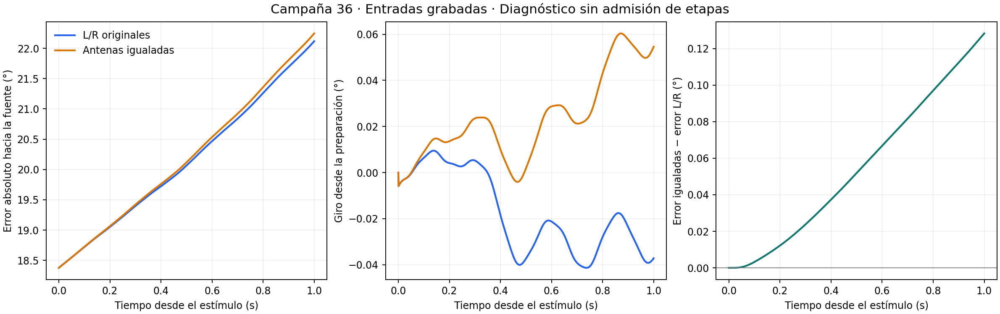

# Resultado descriptivo de la pareja de 1 s

Criba mecánica: **D_HELPS_IN_THIS_DISCRETIZED_MODEL**. Diferencia de error final sinD−D: **+0.128338101°**. Positivo indica que conservar la asimetría de esta cinta ayuda. La criba de 0.022° y la resolución propuesta siguen provisionales; no hay referencia refinada de ambos brazos a 1 s.

| Observable | L/R originales | Antenas igualadas |
|---|---:|---:|
| Error inicial hacia la fuente (°) | 18.376847273 | 18.376847273 |
| Error a 400 ms (°) | 19.722892278 | 19.760242690 |
| Error a 1.000 ms (°) | 22.116783284 | 22.245121385 |
| Avance hacia la fuente (mm) | 0.185342691 | 0.185051198 |
| Mando angular neto integrado (°) | -0.022796211 | 0.069465319 |
| Módulo integrado del mando (°) | 0.157389961 | 0.160442387 |

El mínimo histórico de mejora de rumbo de 0,5° desde preparación y desde 400 ms se conserva: control=False, igualadas=False. El avance tónico no demuestra navegación.

La concentración media de entrada se conserva exactamente. La media neural puede cambiar: diferencia máxima en la media del par PN=0.00459105983; del par DNb05=3.49590414e-05, ambas en unidades del estado q. Esto no identifica por sí solo una conexión de signo incorrecto ni convierte q en una medida fisiológica.

Tiempo de ejecución de los organismos: 3739.031 s y 4290.544 s; total 8029.575 s. Dos vidas distintas de 40+1000 ms; no una trayectoria continua de 2 s. La contención de GPU documentada impide atribuir su diferencia de coste a la intervención sensorial.

Ambos brazos usan entradas grabadas. **Etapas 4 y 5 abiertas**: esta prueba identifica el efecto total de igualar entradas en el modelo discretizado, no utilidad de feedback espacial ni equivalencia biológica. No se modificaron cerebro, lector, cuerpo ni criterios para obtener este resultado.

