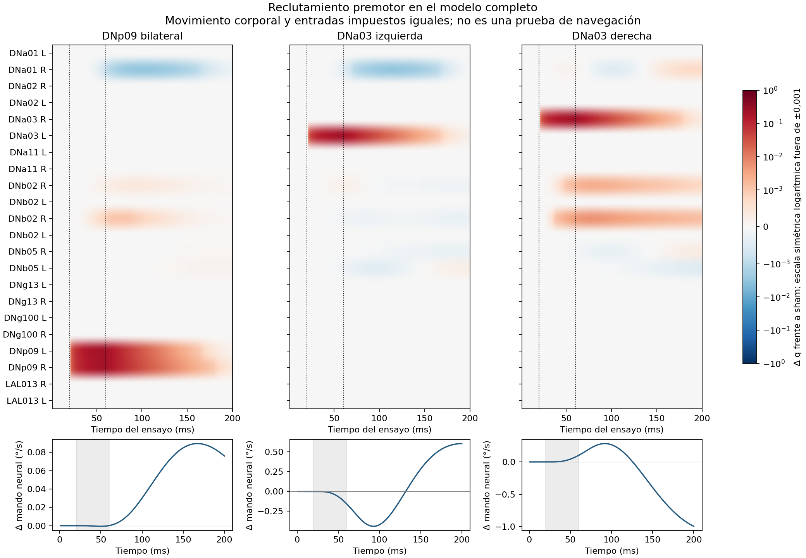

# Campaña38: reclutamiento causal premotor — cierre

Cuatro organismos completos terminaron40ms de preparación +200ms de ensayo cada uno, sin fallos ni cambio de parámetros. Coste total de organismos: 3585.923s; cola completa3589,088s, límite5000s. Etapas4/5 siguen abiertas.

| Intervención | Δq máximo en fuente(s) | Integral del cambio de mando (°) | Extremos del cambio de mando (°/s) |
|---|---:|---:|---:|
| DNp09_bilateral | 0.217137/0.207983 | +0.007801 | -0.000655 a +0.089554 |
| DNa03_izquierda | 0.221548 | +0.005186 | -0.439920 a +0.606755 |
| DNa03_derecha | 0.234329 | -0.028248 | -0.993283 a +0.282963 |

Estas integrales corresponden al mando neural observado: **no son giros medidos**, porque los cuatro cuerpos siguieron la misma cinta. El mando de avance no cambió respecto a sham. La respuesta de DNa03 cambia de signo en el tiempo; elegir un pico o un endpoint aislado sería engañoso.

Sham reproduce exactamente todas las columnas comparadas del donante. Las cuatro preparaciones concuerdan en588 arrays; entradas copiadas y estados físicos/fuerzas coinciden entre brazos. El verificador volvió a leer los arrays de parámetros efectivos antes/después y comprobó que no cambiaron. Capturas CUDA concuerdan con la ecuación consumida. Eso no sustituye una referencia refinada200ms, no asignada en esta criba.

DNp09 modula DNa01 derecha principalmente hacia abajo y una DNb02 derecha hacia arriba. DNa03 izquierda reduce DNa01 derecha; DNa03 derecha aumenta dos DNb02 derechas. Son células ya activas, no nuevos reclutamientos. DNa02, DNa11 y LAL013 permanecieron subumbrales en las consultas registradas de ambos brazos DNa03. DNb05 cambió por debajo de0,001 en q, pero su lector amplifica esos cambios hasta aproximadamente0,61/0,99°/s: el umbral descriptivo del panel no es un umbral de importancia motora.

No se detectó inversión de signo en las conexiones directas DNa03→DNa02/DNa11 examinadas. Las fuentes están anotadas como colinérgicas; la anotación no es una medición independiente del individuo. No simetrizamos ni eliminamos conexiones.

Autocrítica: esta dosis funcional corta no identifica por sí sola una ley celular equivocada. Las constantes actuales son≈19–22ms en las fuentes y5ms en transmisión. Una cadena aislada con target constante0,25 atenúa el pulso40ms a≈0,20 de transmisión; esa cuenta es un contraste matemático, no cota de la red recurrente. La literatura emplea preparaciones y estímulos distintos, incluidos pulsos5s. Fuente activada y destino silencioso sólo delimitan esta dosis, estado y ventana.

## Decisión provisional de Codex, antes de la revisión del cierre

A: identificar la interfaz de lectura con respuestas neuronales y motoras independientes de la navegación; se conserva porque cambios pequeños en DNb05 sí producen mando y DNa03 tiene respuesta bifásica. B: contrastar excitabilidad y transmisión del modelo general con datos fisiológicos y temporalidad de estímulo, sin modificar umbrales para obtener un giro; se prioriza aclarar la barrera observada, sin declararla fallo biológico. C: interfaz conjunta de avance/giro con poblaciones preseleccionadas y validación independiente; sigue abierta porque el avance permanece tónico, pero las respuestas de células omitidas no bastan para añadirlas al lector.

No se promueve otro motor, lector ni calibración. No se lanza una quinta dosis ni una corrida larga de navegación desde esta criba. Siguiente decisión debe distinguir parámetros/estado/entrada insuficiente e interfaz usando evidencia independiente, conservando la alternativa de que el modelo esté actuando según sus leyes sin representar adecuadamente el experimento vivo.

## Verificación portable

El paquete reproduce las observaciones publicadas, no el organismo completo. Incluye trazas, panel22, testigos de entradas/cuerpo, dosis, código y resultados. El verificador portable recalcula efectos y rechaza alteraciones de admisión, contexto, actividad y criterio. Los checkpoints completos quedan locales; la cápsula no verifica por sí sola el operador global ni repite integración o convergencia.

```bash
python3 verify_capsule.py --out VERIFICADO.json --corruption-checks
```



## Protocolo conservado

Estado histórico al inicio: protocolo acotado, sin resultado todavía. Véase cierre arriba.

La alternativa B pregunta si DNp09 bilateral o DNa03 unilateral responde y transmite una señal bajo las leyes vigentes, antes de diseñar otro lector motor. A conserva la alternativa de interfaz identificada; C, coordinación conjunta de avance y giro. El lector normalizado de campaña37 fue descartado y no se rescata ajustándolo.

Cuatro condiciones, cada una con40ms de preparación idéntica y200ms de ensayo: sham, DNp09 bilateral, DNa03 izquierda, DNa03 derecha. Pulso fijo durante[20,60)ms: la primera evaluación nativa deriva la corriente adicional para recorrer25% del rango restante de su target instantáneo. No cambia pesos, umbrales, ganancias, estado q ni línea base. La normalización volumétrica histórica ya está incluida; no se reaplica.

Los mandos corporales y olores provienen de la misma cinta de campaña36. Se verifican estados de integración y fuerzas en cada paso corporal; buffers sensoriales efectivamente copiados en los8 intercambios aceptados de125us y sus8 predictores descartados de62,5us. Los estados recurrentes y la salida PN permanecen libres. El mando neural original se observa sin mover el cuerpo con él en esta prueba de identificación.

La sonda registra22 células elegidas antes de consultar actividad. Sus máximos y conteos abarcan todas las evaluaciones, incluidas las rechazadas: no son ocupación temporal aceptada. Un máximo no positivo limita todas esas evaluaciones; un máximo positivo no garantiza respuesta sostenida. Las rutas estructurales existen hacia las22 células desde las cuatro fuentes, pero ello no prueba transmisión funcional. Una corrección de tipos en la clasificación inicial se conservó en `structure_01`; `structure_02` es la salida corregida.

Presupuesto: máximo4 organismos,5000s agregados,1300s por brazo,18GiB RAM,12GiB GPU,4GiB checkpoints y256MiB observaciones. Un fallo de integridad o límite detiene la cola. No hay calibración por giro ni aprobación de navegación.

ChatGPT proporcionó el núcleo Python original de dosis; Codex lo trasladó al consumidor CUDA real y comprueba ambos cálculos con las mismas entradas nativas. La revisión estática especializada no detectó impedimentos para sham; no ejecutó organismos. La compilación CUDA pasó. No se modifica el motor padre ni se promueve una nueva arquitectura.

El paquete de revisión incluye código del experimento y rutas calculadas, no los checkpoints ni todas las dependencias del organismo. No constituye reproducción autónoma de una corrida completa. Los resultados medidos y su verificador acompañan ahora este protocolo.

Ejecución local, con el entorno GPU ya instalado y el árbol histórico conservado:

```bash
cd /home/daroch/AXIOMA_ASTRA
/home/daroch/miniconda3/envs/GPU/bin/python campanas/etapa4_premotor_recruitment_20260925_38/run_queue.py
```

La cola rechaza un directorio ya utilizado. Consultar `QUEUE.json` y los `RESULT.json` de cada brazo antes de decidir una reanudación; este comando no restaura automáticamente un organismo.
