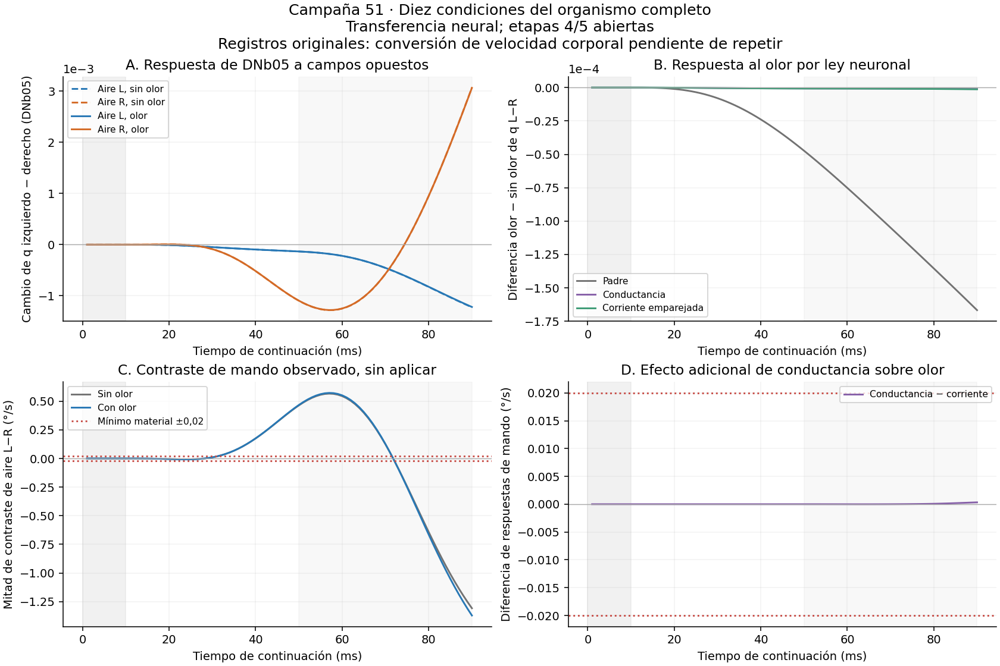

# Campaña 51: comparación ejecutada de alternativas

**Etapas 4 y 5 abiertas. Clasificación: PROMETEDOR_NO_CONFIRMADO, restringida a transferencia neuronal.** Se completaron diez condiciones de 90 ms y 16 ms de cualificación. Ningún brazo aplicó el mando de giro al cuerpo; no hubo perturbación mecánica reservada. Esta campaña no puede acreditar navegación ni recuperación.

La propuesta anterior contenía doce opciones de cuatro autores, agrupadas aquí en diez familias por sus coincidencias. Todas recibieron una prueba discriminante local o un diagnóstico de identificabilidad; sólo aire y ley neuronal se integraron en el organismo completo. El trasplante PN operativo y la cinta propioceptiva completa siguen pendientes. No se presentan como experimentos realizados.

**Fallo de integración descubierto en revisión final:** faltó convertir ×10 la velocidad corporal de cm/s a mm/s antes del receptor de aire. Afecta también G/I con campo cero, porque el cuerpo se mueve. Conservamos los resultados como ejecutados; la versión física corregida no fue reejecutada. La copia correctiva y el test CPU de movimiento conjunto aire/cuerpo están en AIR_UNITS_REPAIR.json y AIR_BODY_UNITS_TEST.json. El PASS de las comprobaciones originales no cubría este contrato de unidades. No promover ninguna variante a lazo físico sobre esos PASS.

## Resultado del organismo completo

| Condición | Media DNb05 izquierda−derecha | Giro calculado, sin aplicar (°/s) | Máximo target DNg100 | Mando de avance bruto (mm/s) |
|---|---:|---:|---:|---:|
| air0_odor0 | -0.02335774 | 2.863232 | 0 | 0 |
| airL_odor0 | -0.02391021 | 2.381532 | 0 | 0 |
| airR_odor0 | -0.02333427 | 2.590476 | 0 | 0 |
| air0_odor1 | -0.02346474 | 2.775008 | 0 | 0 |
| airL_odor1 | -0.02401525 | 2.279959 | 0 | 0 |
| airR_odor1 | -0.02344064 | 2.510139 | 0 | 0 |
| G_odor0 | -0.02410829 | 2.186799 | 0.09647175 | 0.02762862 |
| G_odor1 | -0.02410913 | 2.185957 | 0.09648437 | 0.027632 |
| I_odor0 | -0.02417361 | 2.121398 | 0.3547696 | 0.05020867 |
| I_odor1 | -0.0241745 | 2.120497 | 0.35481 | 0.05021356 |

Medias en la ventana prospectiva 51–90 ms. `q` de los registros es salida normalizada float64 de `hybrid.release()`, distinta de tasas publicadas float32. Para las DN genéricas observadas coincide con su estado; la salida visual transforma el estado interno. El propietario G/I toma su q0 del estado interno completo, comprobado contra el checkpoint de 48.

| Contraste de aire: mitad izquierda−derecha | Sin olor | Con olor | Mínimo absoluto previo |
|---|---:|---:|---:|
| DNb05 q L−R | -0.0002879677 | -0.0002873079 | 0,000016 |
| Giro calculado (°/s) | -0.1044721 | -0.1150902 | 0,02 |

La diferencia de esos contrastes al añadir olor es 6.598083e-07 en q y -0.01061808 °/s. El criterio de materialidad corresponde a cada contraste primario; la interacción con olor se informa sin inventar un criterio retrospectivo. Los relés seleccionados antes de ejecutar responden en ambos sentidos del campo. Los giros medios conservan el mismo signo; además, el contraste instantáneo cambia de signo dentro de la propia ventana51–90ms. Su media no acredita un código direccional estable ni una ley bidireccional de orientación correcta.

**Confusión pendiente entre patrón y entrada total:** el campo izquierdo activa 156 receptores y suma 5169.385 unidades; el derecho activa 179 y suma 5931.538. Se conserva la misma ley por receptor y la desigualdad anatómica, sin ajustar por el resultado. Este experimento muestra dependencia respecto al campo suministrado, pero no selectividad por dirección a intensidad total igualada.

**Ley neuronal G frente a corriente emparejada I:** la diferencia entre respuestas olor−sin olor es 5.41234e-08 en DNb05 q L−R y 5.922441e-05 °/s. Criterio conjunto material: False; exclusión por saturación: False; supervivencia de esta criba: False. Este resultado se refiere a la variante normalizada y acotada evaluada, no a todas las conductancias posibles.

El target de DNg100 se abre bajo G e I incluso sin olor. El cuerpo cambia: desplazamiento G=0.0008272304 mm, I=0.001384738 mm, padre=2.030498e-08 mm entre las muestras1 y90. El mando de avance de la tabla no es esa velocidad medida. BODY_SUPPLEMENT.json conserva posiciones, velocidades y diferencias; no acredita locomoción orientada.

## Operaciones y límites de la prueba

Aire: campo mundial fijo ±100 mm/s en el eje lateral inicial; el receptor recibe aire relativo al cuerpo, no ubicación del olor ni rumbo correcto. Añade drive sólo a 335 JO-C/E y mantiene la recurrencia. La saturación utiliza s=max(proyección firmada,0), siempre no negativa. Los ejes a 45°, 80 unidades y semisaturación 100 mm/s son supuestos de ingeniería. Campo cero conserva la contribución del movimiento relativo del cuerpo. Aire sensorial y torque físico son intervenciones diferentes.

G/I: X=E+drive positivo, Y=I+theta+drive negativo en magnitud; S=X0+Y0 y q0 se congelan al adoptar el modelo. EL=2q0−X0/S es un sesgo compensatorio, no un potencial fisiológico medido. Ambas variantes igualan el valor basal y relajación inicial; I conserva el shunt basal. G cambia la relajación con E+I y ambas recortan target a [0,1]. Se sustituyó sólo la ley BASE genérica, preservando posteriores reemplazos especializados. Un contraste incluye la dinámica recurrente y cualquier realimentación cuerpo→aire que cambie, no sólo una fila local.

| Variante | Filas BASE que alguna vez salen por debajo de 0 | Por encima de 1 | Fracción de nuevas saturadas en población elegible |
|---|---:|---:|---:|
| G_odor0 | 16692 | 440 | 0 |
| G_odor1 | 16381 | 430 | 0 |
| I_odor0 | 16756 | 23369 | 0 |
| I_odor1 | 16457 | 23362 | 0 |

Los extremos son anteriores a los reemplazos especializados; no equivalen a fracción de estados finales recortados. CLIPPING_SUPPLEMENT.json reconstruye además la frecuencia de recorte de todas las evaluaciones DNg100 registradas, incluidas pruebas del integrador. No se guardó esa frecuencia por evaluación para todas las demás filas. Por ello una diferencia no se atribuye automáticamente a un shunt puro.

## Comparación de las diez familias

| Familia y proponente | Prueba ejecutada | Resultado y alcance |
|---|---|---|
| Cinco pares DN (ASTRA; instrumentación Motor_V2) | 30 publicaciones por brazo de 48; cinco lectores en las diez continuaciones de 51 | Mediana y media sin pesos ajustados; resultados nuevos abajo. No se aplicó otro decoder al cuerpo. |
| Oponente DNb05/DNb06 (autor) | Mismos registros y signos fijados | En 48 DNb06 no añade señal; la combinación equivale al aporte DNb05 escalado. No es rescate por sí misma. |
| Acciones DNa02/DNg13 (Motor) | Mismos registros, sin buscar otras DN tras ver el resultado | En 48 ambos canales son silenciosos en precisión publicada; en 51 se informa la lectura float64 sin redondear residuos a actividad material. |
| Proyección DN→premotor→MN (Motor_V2) | Anatomía canónica: conexiones directas y dos saltos, todos los intermedios; 708 MN con somaSide | Aporte extra frente a DNb05: 0.001827221 en la criba48. Conteos y lado somático no son una ley muscular ni garantizan signo de giro. |
| Trasplante PN recíproco (Motor_V2) | Cirugía CPU de 1372 posiciones q/filtro de 686 ALPN y propietario fino completo de 37 arrays y escalares | No-op y reversión exactos; cuatro corrupciones downstream rechazadas. Falta cualificar eventos/cachés y evolución CNS viva. |
| Predictor/JVP (ASTRA; operación local Motor_V2) | Contrafactual de transmisiones ALPN observadas sobre seis filas DN reales | Errores relativos lineal vs finito 0.001382197 y 0.001381128. DNb05 responde con signo local coherente; DNg100 sigue cerrado en este contrafactual. No es un propagador de toda la red ni steering validado. |
| Conductancias (Motor y autor, especificación ASTRA) | Conversión visual local; comparación basal G/I corregida; cuatro condiciones completas | La conversión directa produce gran deriva basal, no rescate olfativo. El ensayo emparejado se interpreta con su resultado y clipping explícitos. |
| Regulación intrínseca (autor) | Seis filas a entrada registrada constante, 50 ms; control de sesgo medio | Diferencia máxima 8.876945e-09; no rescata DNg100. Negativo para esta parametrización local, no para toda homeostasis recurrente. |
| Aire antenal (Motor) | Anatomía, 18 controles CPU y seis condiciones completas | Respuesta en JO, relés y DNb05; contraste material sin prueba de giro correcto ni especificidad olfativa. |
| Contexto propioceptivo (ASTRA) | Contraejemplo geométrico usando el receptor actual y revisión del donante local previo | Las medidas2D de tres patas de Fujiwara no identifican seis ángulos3D: mismas proyecciones/longitudes, ángulos90° y144,7356°. Existe un donante de cinemática reconstruida por IK; el replay previo335ms frente a postura retenida fue negativo para DNa02. No repetirlo como novedad. |

## Lectores alternativos sobre las nuevas continuaciones

| Lector en sombra | Contraste aire sin olor | Contraste aire con olor | Interacción G−I con olor |
|---|---:|---:|---:|
| five_pair_median | -4.056636e-109 | -8.298183e-109 | -1.9806e-06 |
| five_pair_equal_mean | -0.0001277638 | -0.0001276317 | -3.422271e-07 |
| DNb05_DNb06_opponent | -0.0001439838 | -0.0001436539 | 3.110012e-07 |
| DNa02_DNg13_actions | -2.023278e-122 | -7.525838e-121 | -8.701573e-07 |
| fixed_anatomical_soma_projection | 4.436496e-05 | 4.437195e-05 | 2.050958e-08 |

G/I también reactivan basalmente DNa02/DNg13 y la mediana: no permanecerían silenciosos bajo cualquier ley. Casi el mismo cambio aparece sin olor, por lo que no se interpreta como rescate selectivo. Unidades normalizadas de cada lector, no °/s; la proyección anatómica tiene una escala diferente. Pares, signos y pesos anatómicos se fijaron antes de estos arrays. Baseline propio de los primeros10ms; no entrenamiento ni selección de ganador por navegación.

## Verificación, recursos y revisión

CPU instrumentada del piloto y cualificación: 2626.91 s; pared de la cola científica: 2120.26 s; tiempo desde congelación: 2663.40 s. Interacción consumida: 916 ms de 916 autorizados para esta ronda. Cero reintentos de brazos científicos. Las cribas locales tienen costes por ejecutable; importaciones, lecturas y reparaciones auxiliares no se presentan como CPU total de sesión medida.

La revisión final de Motor C++/CUDA recalculó por separado los diez contrastes y coincidió con estas cifras; detectó además el fallo físico de unidades. Con la trayectoria observada fija, corregir la velocidad cambia la entrada máxima por receptor G_olor=0.02601616, I_olor=0.05418445; cambios máximos de suma instantánea 6.914267 y 14.46308. No son cotas del CNS corregido. En aire sin avance, el cambio por receptor es mucho menor. El test CPU correctivo da movimiento conjunto nulo y expone el fallo antiguo con velocidades conocidas; ejecución CNS corregida pendiente.

La cualificación16ms compara las33 observaciones del padre con49, q0 interno con48, adopción común G/I y ecuaciones CPU/CUDA en3232 evaluaciones-célula DNg por variante. La evidencia completa se recalcula desde arrays y contrato, también bajo Python -O, con pruebas de corrupción y hashes. Véase REPRODUCIR.md. Preservamos fallos auxiliares de metadatos PN, selección de lado somático, orden de suma y confusión estado/salida del verificador portable; no cambiaron el algoritmo científico ni tolerancias para cambiar una conclusión.

Una preparación inicial común, un campo por lado y una ventana de90ms: los puntos temporales no son semillas independientes. No hay intervalos poblacionales ni cohorte confirmatoria reservada. El nuevo checkpoint51 conserva su propietario y esquema propio; su reanudación GPU portable no está cualificada.

ChatGPT ASTRA_V2 revisó normalización, control basal y límites de clipping; ChatGPT_Motor_V2 distinguió signo local matemático de steering y delimitó el trasplante; Motor C++/CUDA aportó anatomía, receptor de aire y la prueba propioceptiva. Se conservan textos y fuentes. Sus recomendaciones no sustituyen medidas; no se atribuye PRO verificado ni revisión ciega. La revisión final local independiente, si está presente en aporte_motor, identifica qué arrays recalculó.

## Decisión y próximas alternativas

A. Primero cualificar y repetir la corrección de unidades en otra ronda acotada; conservar provisionalmente el receptor de aire y comprobar dirección frente a entrada total emparejada, permutación y replay. Sólo después probar su utilidad física con el cuerpo actual y lector congelado, separando orientación asistida de iniciación autónoma. No ajustar el signo ni recentrar el mando con los resultados de estas diez condiciones.

B. Completar la intervención recíproca PN con carga viva, estado de eventos y control no-op antes de gastar una nueva comparación CNS. El JVP local aporta una predicción comprobable de transferencia hacia DNb05; aún no localiza por sí solo toda la limitación posterior.

C. Si se prueba contexto locomotor, reutilizar el donante IK local como reconstrucción declarada y contrastar coordinación temporal con marginales sensoriales iguales. No completar grados de libertad desconocidos presentándolos como medición ni repetir el negativo previo de postura retenida. Las patas/músculos siguen posteriores; no se integra una marcha completa para ocultar la falta de mando.

Los dos ChatGPT coinciden en priorizar la interfaz aérea condicionada a reparación y control de intensidad, y reducir la prioridad de G como mejora selectiva del olor. Motor_V2 precisa que el emparejamiento debe comprobarse en la entrada JO realmente consumida, no sólo en número de receptores o campo impuesto. ASTRA distingue excitabilidad basal de transferencia informativa. No se adopta literalmente su referencia a filas clippeadas: los conteos registrados son de target BASE antes de reemplazos especializados.

Cada ruta necesita otro contrato y presupuesto antes de ejecutarse; se conserva el límite de dos prototipos completos por ronda. Este cierre termina una comparación acotada, no declara imposibilidad del proyecto ni promete que las etapas sean alcanzables con la variante actual. Un efecto neuronal útil no sustituye la conducta online y el control por replay de etapa4 ni la recuperación mecánica reservada de etapa5.

Fuentes y procedencia: PILOT_PLAN.json, PILOT_SOURCES.json, PARENT_DIFF.patch, datos por condición y suplementos. La motivación cualitativa de JO-C/E está en [Suver2019](https://pmc.ncbi.nlm.nih.gov/articles/PMC6533146/); la limitación de observables propioceptivos usa la documentación del [depósito Fujiwara](https://zenodo.org/records/6365304). Ninguna fuente calibra automáticamente nuestros ejes, amplitudes, pesos ni receptores.
