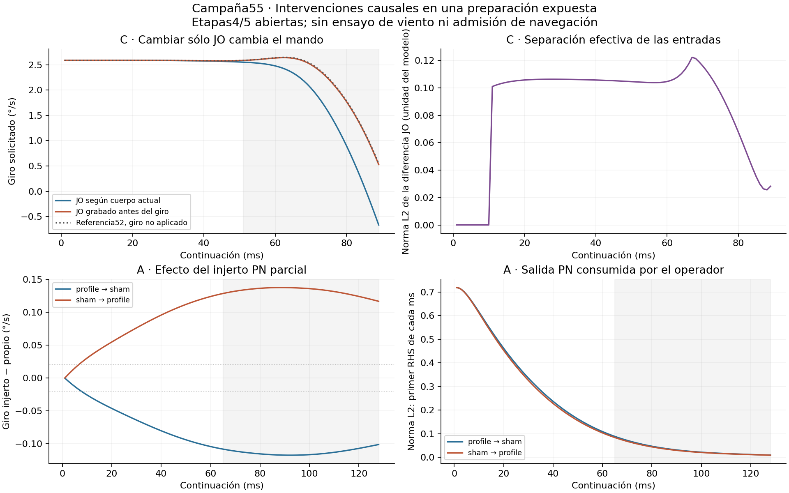

# Campaña55 — resultados verificados

**Las etapas4/5 siguen abiertas.** Se ejecutaron dos instrumentos causales, con controles exactos previos. No se cambió ningún peso, umbral ni ganancia del lector. I es el control de corriente con shunt basal, no una ley instantánea fisiológicamente validada. Se usó sólo en el diagnóstico JO; el intercambio PN conserva la ley original.

## C: feedback corporal por JO

En la ventana51–89ms, cambiar sólo la entrada JO lleva el giro medio de **1.625991 a 2.149421°/s**. La referencia52, anterior a aplicar el giro al cuerpo, era 2.160061°/s. El cambio es +0.523430°/s y +0.000495015q en DNb05 L−R; ambos superan los mínimos diagnósticos congelados.
La separación relativa L2 de JO fue 0.224003. Se reduce 98.01% de la distancia entre estas medias de giro. **Ese porcentaje no es una fracción causal del cerebro ni una validación de navegación.** Queda un residuo de -0.010640°/s. Los registros52/54 ya diferían ligeramente antes de activar el extraJO.
El control online reproduce los36 campos de54 y las166700 salidas finales exactamente. La cinta procede de52, obtenida antes de la intervención corporal; no es la propia cinta online desde el mismo estado. Sólo se sustituye el extraJO declarado; se conserva la entrada nativa. Otros sensores siguen sus políticas online y pueden cambiar como consecuencia de la divergencia corporal. Dosis y distribución JO cambian conjuntamente: este experimento no identifica selectividad direccional independiente de cantidad.

## A: frontera PN parcial

Se intercambiaron una sola vez1372 coordenadas: actividad y filtro común de686ALPN, entre los estados alcanzados por48/sham y48/profile al mismo reloj. Se conservaron PN fina10208, entradas/receptores, memorias PN→KC, DN, cuerpo, pesos y lector del receptor. Los controles vivos de identidad de ambos receptores fueron exactos antes de los cruces.

| Receptor ← donante | Δgiro medio65–128ms (°/s) | ΔDNb L−R (q) | Diferencia relativa PN consumida | Avance medio con injerto (mm/s) |
|---|---:|---:|---:|---:|
| sham_from_profile | -0.11270709 | -0.00013303888 | 0.00195112 | 0 |
| profile_from_sham | +0.13220012 | +0.000135516 | 0.00184029 | 0 |

Transporte recíproco material según contrato: **False**. Clasificación de esta criba: **DESCARTADO**. El resultado se refiere sólo a esta frontera y ventana, no a la existencia de toda ruta PN. Los máximos transitorios y sus instantes están en RESULTADOS.json, separados de la ventana primaria.

El primer injerto cruzado falló antes de completar1ms por una discontinuidad no declarada en siete entradas GABA. La reparación añadió un evento explícito con retardo125µs; conservó ocupación e historia previa y repitió los dos controles de identidad. No cambió la ley neuronal, pesos, criterios ni ventanas. El intento y su coste siguen contabilizados. [Reparación y prueba matemática](REPARACION.md).

Criterios propios de DN/giro y dirección hacia el donante cumplidos en ambos sentidos: **sí**. Los giros medios absolutos siguen siendo positivos: la reciprocidad corresponde a cambios respecto a cada control, no a giros absolutos opuestos. La separaciónPN agregada es 0.195% / 0.184%, frente al mínimo prospectivo de 1%. Criba conjunta: **False**. Máximo target DNg100 en los cuatro brazosPN: 0; máximo mando de avance: 0mm/s. Se mantienen los criterios originales; un fallo de promoción no borra un efecto causal medido.

## B y decisión

La cinética ORN→PN existente ya contiene recursos y depresión de dos componentes. Se conserva la alternativa de contrastar transferencia temporal con observables locales, sin añadir una nueva ley por analogía. [Datos, artículo y decisión](B_DATOS.md). Esta ronda no implementa un tercer organismo. [Interpretación y siguiente discriminador](DECISION.md).

## Evidencia y límites

Consumidos **703ms CNS intentados/702 comprometidos**, 2605.411sCPU de trabajadores y 2516.089s de cola acumulada. Topes:800ms,4000sCPU,3600scola. Dos instrumentos, seis brazos científicos, seis controles cortos y un intento fallido preservado. No hubo selección por semillas; es una preparación de desarrollo ya expuesta, no confirmación reservada.
Motor C++/CUDA reconstruyó independientemente JO y los cuatro brazos PN desde los registros, sin ejecutar el verificador autoral: cifras, ventana y lector coinciden exactamente. Su revisión distingue el efecto causal medido del fallo de promoción y de la ausencia de avance; véanse aporte_motor/REVISION_JO55.md y aporte_motor/REVISION_PN55.md en el ZIP. ChatGPT ASTRA_V2 y ChatGPT_Motor_V2 contribuyeron restricciones/propuestas; no se les atribuye ejecución local ni modo PRO verificado. Las respuestas y la delimitación de propietarios están conservadas.
El verificador reconstruye cifras, criterios, mandos, entradas registradas, integridad del injerto, decisiones de integración y presupuestos desde arrays y contrato. Incluye corrupción deliberada bajo Python−O. JO conserva contadores por cada evaluación y las últimas muestras; PN conserva primera/última/mínima/máxima salida por intervalo. No son cintas completas de todos los RHS. La igualdad de los targets ORN fue comprobada durante ejecución; sus contadores transitorios no se archivaron por separado.
Hay estados científicos completos y fuentes preservadas. La reproducción CPU desde extracción limpia se verifica en la entrega; no se atribuye una reanudación GPU portable que no se haya ejecutado.



Verificación local desde la raíz:

```bash
/home/daroch/miniconda3/envs/GPU/bin/python -B -O campanas/etapa45_transferencia_causal_20260928_55/verify55.py --corruptions
```
