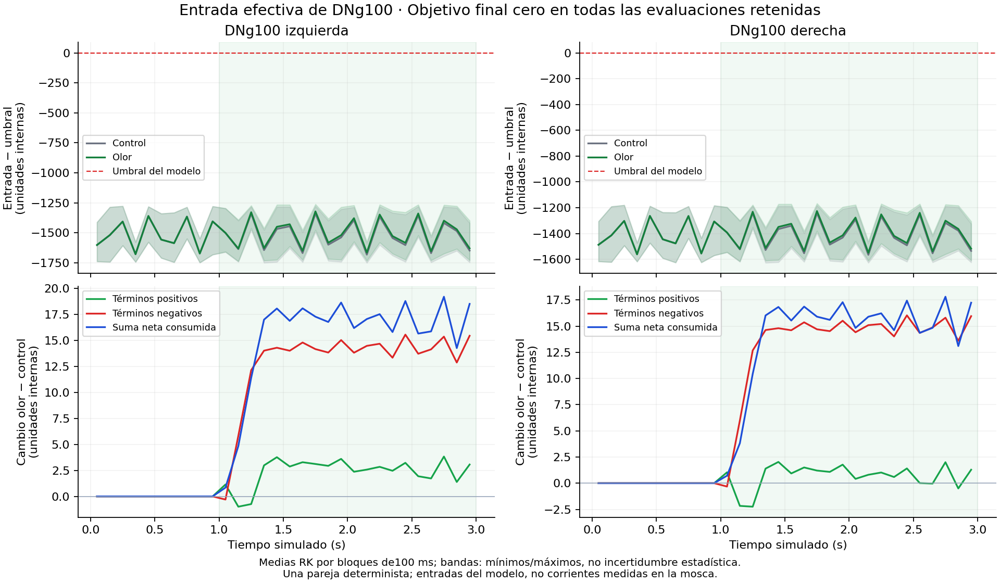

# Diagnóstico funcional47 — resultado de la adquisición

El objetivo de ambas DNg100 permaneció exactamente en cero en las evaluaciones retenidas que construyen la solución, tanto con olor como en control. La entrada quedó por debajo del umbral, con ganancia positiva y sin sustitución del objetivo de base. Esto localiza la ausencia de reclutamiento en el balance y la ley del modelo bajo este contexto. No aporta evidencia de una respuesta positiva perdida por el lector.

Dos condiciones completas de3s, cada una restaurada desde el mismo preparado. Las trazas,
publicaciones y eventos guardados coinciden exactamente con los primeros3s de45.
Se observaron operandos consumidos en47; no se recuperaron retrospectivamente estados internos
de45 que no se habían guardado. Etapas4/5 continúan abiertas.

| DNg100 | Mayor margen control | Mayor margen olor | Δ positivos | Δ negativos | Δ neto |
|---|---:|---:|---:|---:|---:|
| 10045 | -1277.895 | -1261.292 | 2.373 | 13.063 | 15.435 |
| 10056 | -1181.626 | -1166.338 | 0.676 | 13.595 | 14.271 |

Estímulo consumido en1001–3000ms. Los cambios son medias ponderadas por las etapasRK que
construyen la solución, en unidades internas. No son pA, ensayos independientes ni una
descomposición causal. Predictores descartados, intentos rechazados y k4 están separados.

Conservar el motor numérico y cerrar este diagnóstico. No bajar umbrales, retirar inhibición ni prolongar esta misma vida para buscar movimiento. El siguiente cambio necesita una correspondencia independiente entre estímulo, contexto y respuesta neural, o una ley de circuito restringida por datos; las alternativas y descartes quedan en [DECISION.md](DECISION.md). No se lanza automáticamente otra simulación.

Tiempo total de la cola: 144.5min. CPU de la cola:
10157.1s. Sin reintentos, cambios de parámetros ni plasticidad.
Presupuesto original6300s/brazo,12600s agregados. El coste de postproceso está en CIERRE.json.

ChatGPT revisó el código sin ejecutar el organismo y detectó un defecto de clasificación:
ausencia de objetivos positivos no equivale a cero literal. El analizador original y
RESULTADOS.json se conservan; [DICTAMEN.json](DICTAMEN.json) corrige únicamente ese punto
usando los extremos registrados. Jev priorizó separar predictores y evolución retenida;
su clasificación no constituye validación científica.

Reproducción de los resúmenes desde los registros: `python analyze.py` y `python diagnosis.py`.
`finish.py` añade figura e informe cuando la cola completa ya existe; no integra neuronas.
[Contexto marcha/parada de45](CONTEXT45.csv), [revisión de código](CHATGPT_CODIGO.md),
[decisión fundada](DECISION.md).
