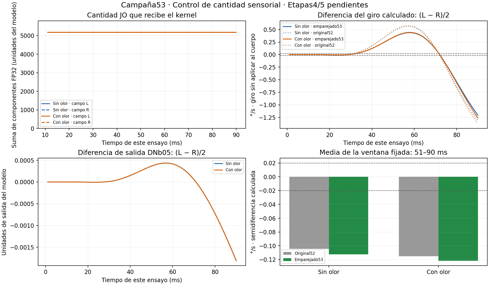

# Resultado de la campaña53: cantidad JO emparejada

**Etapas4/5 siguen abiertas.** Esta campaña compara transferencia neuronal; registra giro sin aplicarlo al cuerpo y no ensaya perturbaciones mecánicas.

| Condición | Giro calculado original52 | Giro calculado emparejado53 | Diferencia DNb05 emparejada | Criterio material heredado |
|---|---:|---:|---:|---|
| Sin olor | -0.104472 °/s | -0.112447 °/s | -0.000242724299 | Persiste |
| Con olor | -0.115090 °/s | -0.121657 °/s | -0.000242497714 | Persiste |

Valores: semidiferencia entre campos L/R, promediada en51–90ms. La referencia52 es histórica y expuesta, no otra réplica nueva.

El efecto material persiste en Sin olor, Con olor. La diferencia de suma no basta para explicar ese contraste; no identifica todavía un controlador direccional útil.

Cantidad común fijada: 5169.385265794 unidades internas. Máxima diferencia entre sumas consumidas: 7.82012939e-05; límite prospectivo 0.00103387705.
La normalización conserva identidades y soporte. No empareja simultáneamente L2, número de células activas ni conectividad. Se registró el vector FP32 real y se comprobó ausencia de discrepancias en las evaluaciones del kernel.

Cualificación:2ms con normalización desactivada, campos previos/propietarios/eventos exactos frente a52. Cuatro brazos de90ms: total 362ms CNS. CPU de trabajadores 1051.808s; cola 973.504s. Preparación y análisis se contabilizan aparte.

La interacción con olor, las trayectorias temporales, los grupos anatómicos y hashes se reconstruyen en RESULTADOS.json. Un signo constante no es requisito general de control; estas señales tampoco constituyen por sí solas orientación, iniciación por olor ni aprendizaje.

Reproducción analítica: `python -B -O verify53.py`. Requiere NumPy, arrays de esta carpeta y referencias52 incluidas; no inicia CNS/GPU. No volver a lanzar la cola sobre los directorios cerrados.
