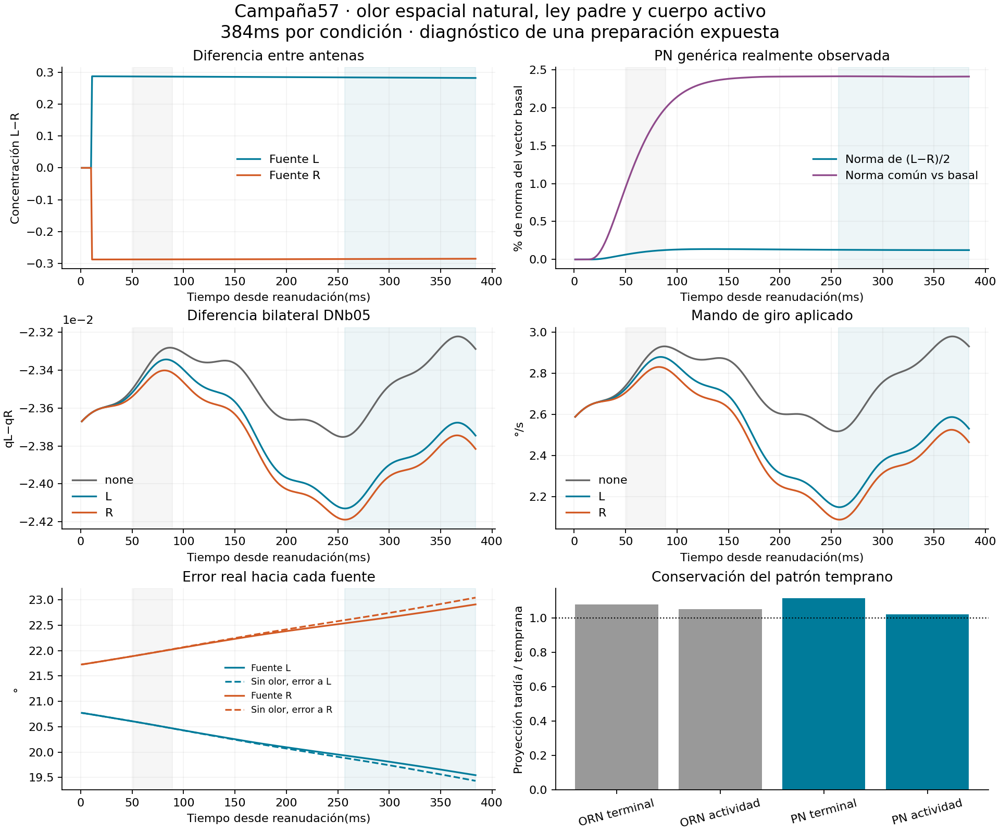

# Campaña57 — señal sensorial natural y giro

**No supera la criba diagnóstica congelada. DESCARTADO, exclusivamente para promoción desde este preparado de 384 ms. Etapas 4/5 abiertas.** No hubo viento ni comparación reservada de feedback. La intervención independiente es la posición de la fuente; observar una frontera no prueba por sí solo su mediación causal.

Tres vidas emparejadas desde 48/sham, 384 ms cada una y prefijo basal de 10 ms. Ley padre, cuerpo, lector y perfil sensorial de 54 conservados. Cualificación de 2 ms exacta frente a 56; tres prefijos de 89 ms exactos frente a 54. Nuevo registro sólo lectura de 686 PN y 694 ORN en la frontera CSR, actividad comprometida, filtros DM1 y salidas finas.

## Resultado descendente y corporal

Medias257–384ms. Los errores finales se evalúan siempre respecto de ambas fuentes, incluida la trayectoria sin olor.

| Fuente | Giro solicitado(°/s) | Avance solicitado(mm/s) | Máximo targetDNg100, todosRHS | Error finalL,R(°) |
|---|---:|---:|---:|---|
| none | 2.794761155 | 0.000000000 | 0 | 19.434879922, 23.043964722 |
| L | 2.406684436 | 0.000000000 | 0 | 19.546462571, 22.934471263 |
| R | 2.345960651 | 0.000000000 | 0 | 19.570866945, 22.910516487 |

SemidiferenciaL−R: DNb05 **3.150332089e-05q**, giro **0.03036189247°/s**. Mínimos conservados1.6e−5q y0.02°/s; materialidad conjunta=True. Componente común de giro frente a none: **-0.4184386117°/s**. Signo del contraste compatible con fuentes=True.

Beneficio de error frente a la trayectoria sin olor, para cada fuente: **L -0.1115826484°; R +0.1334482349°**. Ambos positivos=False. Un contraste motor material no sustituye este resultado corporal. El mando de avance y el desplazamiento físico son observables distintos: todas las poses, fuerzas y desplazamientos están conservados.

## Señal natural registrada

Contraste fuenteL−fuenteR dividido por2. La plantilla es su vector medio51–89ms; se proyecta después257–384ms. Son estadísticas descriptivas de la misma vida, sin selección de células ni lector operativo. Las normas de fronteras con unidades distintas no son ganancias fisiológicas comparables.

| Frontera | Norma media temprana | Norma media tardía | Proyección tardía/temprana | Coseno de vectores medios |
|---|---:|---:|---:|---:|
| nominal_ORN_Hz | 23.4529 | 23.45896 | 0.9918798 | 0.9917678 |
| ORN_generic_first_RHS | 0.1083759 | 0.1179212 | 1.078898 | 0.9916742 |
| ORN_q_committed | 0.1110718 | 0.1179379 | 1.052897 | 0.9917199 |
| PN_generic_first_RHS | 0.01988676 | 0.0246469 | 1.115953 | 0.9011504 |
| PN_generic_last_RHS | 0.02018303 | 0.02464065 | 1.09914 | 0.9010812 |
| PN_q_committed | 0.02164955 | 0.0246108 | 1.022265 | 0.9002577 |
| DM1_filters_committed | 0.03344601 | 0.1178498 | 3.277119 | 0.9270679 |
| fine_PN_KC_gamma_and_additional | 3.393148e-06 | 1.934068e-05 | 5.684088 | 0.9971795 |

Se publican también el componente común[(L+R)/2−none], contrastes individualesL−none/R−none, curvas y resúmenes discretos por1ms. Los testigosCSR contienenfirst/last/min/max/count, incluyendo evaluaciones predictoras/rechazadas;8llamadas adicionales de calentamiento sólo en el primer ms. No se reconstruye una integral física de todas las entradas, ni se equiparaCSR con el consumidor especializado dePN. El proxy periférico utiliza concentraciones geométricas: no es transducción química calibrada. La anatomía323L/371R conserva una diferencia inicial de dosis total aproximada0.77%; no se aísla dirección pura de cantidad.

## Comprobaciones y presupuesto

1154msCNS intentados y1154 comprometidos; 2370.453752sCPU de trabajadores y2153.349449s de cola, dentro1200/6000/5000. El tiempo total de investigación y cierre es mayor y se registra por separado. Reloj corporal verificado por40sumas exactas25µs por ms. Extensión del guard periférico3200→3384; no se amplió el cargador49 ni se cualificó reanudaciónGPU desde el final.

El verificador reconstruyó resultados y rechazó **17corrupciones deliberadas bajo−O**. Dos reparaciones analíticas están documentadas: incluir las 8 llamadas iniciales de calentamiento, y comparar la geometría latente del prefijo contra su propia fuente en vez de exigir igualdad entre fuentes distintas. La concentración consumida y todos los estados del prefijo sí coinciden exactamente. Se conservaron fallos y fuentes previas, sin cambiar el contrato ni repetir CNS. ContratoSHA`e67c78284b40727d31e865a904aa8d49e930dbcd6b32aa41b51dde80cbf7cb57`.

Una preparación expuesta, sin cohorte nueva, no permite atribuir robustez entre organismos ni equivalencia biológica. Las revisiones conceptuales de los dos ChatGPT y la revisión de archivos de Motor se identifican por separado. [Decisión y alternativas](DECISION.md), [fuentes y límites](FUENTES_Y_DECISIONES.md), [reproducción](REPRODUCIR.md).

