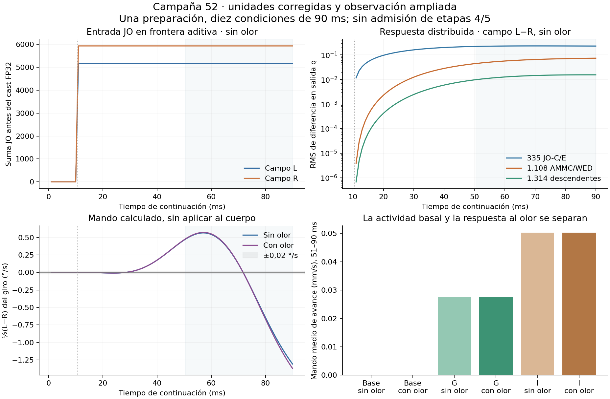

# Campaña52 — reparación cualificada y comparación terminada

**Las etapas4/5 siguen abiertas.** Se completaron diez condiciones de90ms y16ms de cualificación desde la misma preparación48. La conversión de velocidad corporal cm/s→mm/s quedó corregida y comprobada en la simulación. El registro pasó de16salidas a una población anatómica de2757células, más694ORN identificadas por separado. Ningún resultado de esta campaña aplica el giro calculado al cuerpo.

Clasificación de la pista de transferencia: **PROMETEDOR_NO_CONFIRMADO**. Reparación e instrumentación: **CONFIRMADO_LOCALMENTE_PENDIENTE_AUDITORIA**, dentro de los pares y tiempos comprobados. No hay equivalencia fisiológica ni aprendizaje general demostrado.

## Resultado con los criterios conservados

Ventana51–90ms; mínimos originales1,6e−5 en q y0,02°/s en giro calculado. CampoL/R son condiciones opuestas aplicadas al conjuntoJO de ambas antenas, no mediciones separadas de una sola antena.

| Condición | ½(L−R) DNb05, q | ½(L−R) giro calculado, °/s | Diferencia total JO R/L, fronteraFP64 |
|---|---:|---:|---:|
| Sin olor | -0.000287967662 | -0.104472125 | 14.743589% |
| Con olor | -0.000287307854 | -0.115090206 | 14.743589% |

Los dos contrastes de aire cumplen el umbral conjunto: **True**. Eso conserva una pista de transferencia en este modelo. No demuestra que el circuito codifique correctamente el rumbo: la cantidad totalJO sigue confundida con su configuración, y el signo temporal se informa completo en `POPULATIONS.json`.

La interacción específica(Gconolor−Gsinolor)−(Iconolor−Isinolor) es **5.38764655e-08q** y **5.91091403e-05°/s**. Supera ambos criterios: **False**; promoción tras control de saturación: **False**. No confundir excitabilidad basal G/I con un rescate olfativo selectivo.

| Brazo | Mando medio de avance (mm/s) | Desplazamiento físico entre muestras1y90 (mm) |
|---|---:|---:|
| air0_odor0 | 0 | 2.03049829e-08 |
| air0_odor1 | 0 | 2.03049829e-08 |
| G_odor0 | 0.0276292011 | 0.000827245808 |
| G_odor1 | 0.0276325825 | 0.000827344151 |
| I_odor0 | 0.0502098608 | 0.00138476739 |
| I_odor1 | 0.0502147457 | 0.00138489992 |

El mando tiene unidades de velocidad, pero no es el desplazamiento observado. La tabla conserva ambos. El desplazamiento indicado abarca89ms entre las muestras1y90; no se presenta como marcha estable. El giro aplicado fue cero por diseño, con comprobación desde las trazas. No se aplicó perturbación mecánica para la etapa5.

## Lo que permite ver el registro ampliado

| Población | Células observadas | Diferentes en algún instante, sin olor | Diferentes al final, sin olor |
|---|---:|---:|---:|
| JO-C/E | 335 | 235 | 235 |
| AMMC/WED | 1108 | 581 | 580 |
| Descendentes | 1314 | 534 | 532 |

Conteos del contrasteL−R con|Δq|>1e−6. Es un umbral descriptivo; no está calibrado contra ruido fisiológico ni identifica neuronas de orientación. Las curvas guardan tiempos cada1ms, magnitud y signo, sin seleccionar otro lector o ajustar ganancia/polaridad. Los puertosPN y los registrosRHS de dosDNg100 conservan variables y relojes distintos. No se impone una cadenaJO→PN olfativa.

## Qué cambió al reparar las unidades

| Brazo | Máxima diferencia q en las16células heredadas frente a51 | Máxima diferencia JO |
|---|---:|---:|
| air0_odor0 | 5.22084459e-12 | 1.46600121e-07 |
| airL_odor0 | 0 | 5.03052036e-08 |
| airR_odor0 | 0 | 5.03052036e-08 |
| air0_odor1 | 2.22044605e-16 | 1.46600121e-07 |
| airL_odor1 | 0 | 5.03052036e-08 |
| airR_odor1 | 0 | 5.03052036e-08 |
| G_odor0 | 0.00354429362 | 0.0260135877 |
| G_odor1 | 0.00354331901 | 0.0260168992 |
| I_odor0 | 0.00824875889 | 0.054180773 |
| I_odor1 | 0.00824966943 | 0.0541861427 |

La reparación cambió más de1e−6 la salida final de **1076descendentes en G sin olor** y **1095 en I sin olor**. No era legítimo acotar el cambio cerebral a partir de una diferencia pequeña de entrada. La repetición demuestra ahora que esos cambios no modificaron la conclusión del contraste olfativo específico.

**Precisión del registro:** `JO_drive` y su testigo corresponden a la suma aditivaFP64, antes de la conversión de `FastCSR` aFP32. La reconstrucciónCPU de esa conversión explica la invariancia de los camposL/R: cambian valoresFP64 hasta5,03e−8, pero ningún valorFP32 lateral cambia. La velocidad corporal era diminuta, no exactamente cero. Campo0 y G/I sí cambian enFP32. Tras convertir componentes y sumarlos enFP64, la diferencia de total lateral sigue siendo **14.743589744%**. Esto es una reconstrucción del componenteJO bajo el contrato nativo de entradaJO basal cero, no una nueva capturaJO dentro de todos losRHS.

Se compara con los arrays51 expuestos, no con cifras copiadas del informe. Sólo la conversión física y la observación ampliada cambian en52; las leyes, preparación y criterios quedan conservados. Los originales51 permanecen intactos. Una diferencia pequeña en estas condiciones no habría permitido omitir la comprobación física, y no acota otros regímenes corporales.

## Cualificación, presupuesto y alcance

Identidad de33campos frente a49; tres pares vivos con/sin observador ampliado;11/12propietarios científicos,58campos comunes y secuenciaevent_audit exactos. El observadorDNg heredado es común: esta prueba no demuestra su neutralidad universal. Motor C++/CUDA hizo verificación independiente desde copia limpia y reconstrucciónJO con otra implementación. ChatGPT ASTRA_V2 y ChatGPT_Motor_V2 aportaron críticas conceptuales; no se les atribuye ejecución de arrays ni modoPRO verificado.

Ejecución de cola: **916msCNS**, **2909.568sCPU** y **2601.541s de pared**. Límites previos:916msCNS/5000sCPU/4200spared/24GiBRAM/14GiBVRAM/8GiB. Análisis y empaquetado tienen recibos adicionales; el tiempo de cola no representa toda la sesión. No hubo reintentos ni ampliación por observar un resultado negativo. Una preparación; diez condiciones no son diez organismos independientes ni una cohorte ciega.

## Decisión y alternativas

El control de cantidad tiene justificación según la puerta declarada: **True**. El siguiente contraste propuesto esL1 totalJO emparejado conservando soporte/proporciones, en otra campaña de cuatro brazos90ms con presupuesto propio. Sólo elimina la diferencia de total; no controla simultáneamenteL2, número activo y anatomía. No se ha ejecutado en52.

La cribaCPU de entradas51 mostró que una permutación dentro de(tipo,rootSide) movía320identidades pero dejaba160vectores exactamente iguales. Esa variante es no-op y se descarta como prueba informativa. IgualarL2 y reducir soporte para un multiconjunto común siguen siendo intervenciones distintas, con otros factores de confusión; un negativo tras retirar identidades no se atribuye automáticamente a cantidad.

La normalización idealL1 de esa criba tenía un residualFP64 de1,82e−12; después de convertir componentes aFP32, la diferencia máxima de sumasL/R es **7.82012939e-05** unidades. No afirmar igualdad exacta del operador a partir del primer residual. La siguiente campaña deberá fijar y verificar prospectivamente la frontera y el criterio numérico posterior a esa conversión, sin elegirlos para cambiar un veredicto neural.

Se mantienen las alternativas de transmisión/estado y contexto propioceptivo con sus controles propios. A orientación con el cuerpo actual; B CNS→VNC acotado; C músculos y seis patas posteriores. No adoptar un diccionario o predictor externo como controlador ni exigirlo como nueva puerta de etapa.

Hito de esta ronda: reparación y observación cualificadas, repetición finita completa y comparación reproducible. La etapa4 requiere una prueba conductual online contra controles emparejados; la5 requiere recuperación ante perturbación reservada. Esta campaña no las reemplaza.

