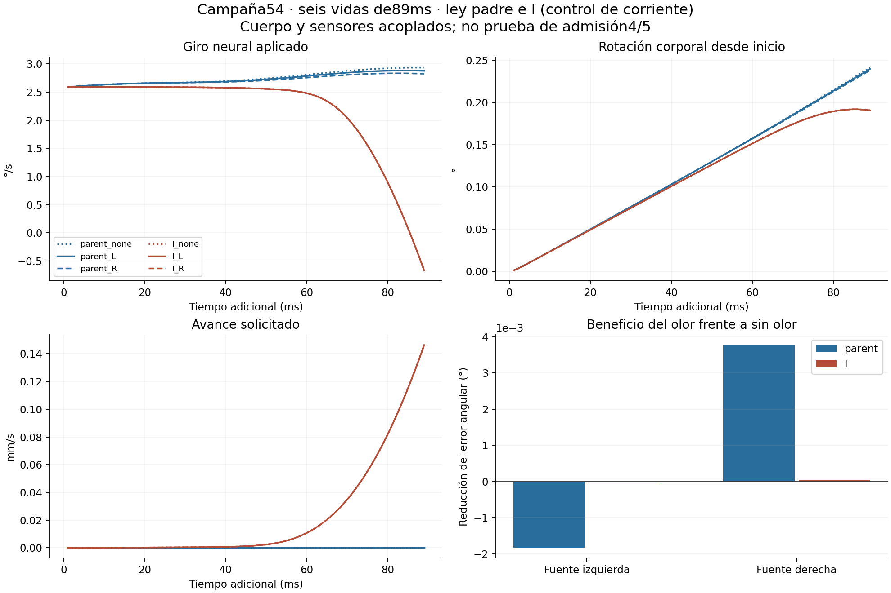

# Campaña54 — olor espacial y cuerpo con giro aplicado

**Etapas4/5 abiertas.** Piloto de desarrollo desde el mismo estado48, con fuente fija en el mundo, lectura bilateral de antenas cada1ms, avance y giro neurales aplicados. Dos leyes (padre e I/control de corriente) y tres condiciones (sin olor, fuente izquierda, fuente derecha).89ms por brazo, dos cualificaciones repetidas de2ms. No es una prueba de recuperación ni una cohorte confirmatoria.

|Brazo|Avance medio(mm/s)|Giro medio(°/s)|Rotación corporal(°)|Máximo objetivoDNg100|
|---|---:|---:|---:|---:|
|parent_none|0|2.86151144|0.241378046|0|
|parent_L|0|2.82772505|0.239931392|0|
|parent_R|0|2.79041232|0.238344048|0|
|I_none|0.0490469629|1.62599073|0.190847569|0.346403956|
|I_L|0.049049617|1.62574579|0.190831304|0.346425758|
|I_R|0.0490496757|1.62521264|0.190811135|0.346426591|

Medias de mando en51–89ms; rotación entre inicio y fin; máximoDNg100 incluye evaluaciones intermedias/rechazadas del integrador. DNg100 es estado/objetivo normalizado, no un recuento de espigas.

|Ley|SemidiferenciaL−R DNb05(q)|SemidiferenciaL−R yaw(°/s)|BeneficioL vs none(°)|BeneficioR vs none(°)|Criba para vida larga|
|---|---:|---:|---:|---:|---|
|parent|2.24269126e-05|0.0186563671|-0.00183222309|0.00377676944|DESCARTADO en esta criba|
|I|2.46658381e-07|0.000266575856|-2.19361951e-05|4.41517815e-05|DESCARTADO en esta criba|

Positivo en beneficio significa menor error que el control sin olor de la misma ley, evaluado contra la misma fuente. No basta una sola fuente favorable. Mínimos neuronales conservados:1,6e−5q y0,02°/s. Cambiar dirección y cantidad totalORN sigue parcialmente confundido por323ORN izquierdas frente a371 derechas; no se normalizó después de observar resultados.

Saturación nueva elegible I frente a padre: none=0, L=0, R=0. El detalle de objetivos base fuera de0..1 queda en RESULTADOS.json; no se confunde ese objetivo previo a overrides con el estado final.

El primer intento conserva un fallo de unidades en el adaptador nuevo: entregaba rad/s a una entrada de giro normalizada. Se detuvo antes del primer ms comprometido del brazo científico. La reparación sólo codifica la señal de entrada correcta y reproduce exactamente360 mandos observados; la ganancia histórica5°/s permanece. Se repitieron ambas cualificaciones y se redujo cada brazo de90a89ms para respetar el presupuesto agregado.

Coste de ambos intentos: 543msCNS intentados, 542ms comprometidos; 1676.851sCPU de trabajadores, 1607.381s de cola. Topes originales544ms,3300sCPU,3000s de cola. Análisis/entregaCPU separados y sin nueva integración.

Verificación: todos los campos comunes de cualificación iguales a52; lector, reloj, latencia, geometría, tasas nominales y métricas reconstruidos desde arrays. Nominal ORN rates and body→sensor geometry independently recomputed offline. Equality at every actual ORN RHS target was checked by the frozen runner; its transient counters were not stored for separate offline recomputation.

Reproducción corta: `python -B -O check_delivery54.py --corruptions`. Reproducción completa del análisis guardado: `python -B -O verify54.py` (incluida también en la comprobación corta). Los estados completos se conservan en la cápsula local; no se cualificó reanudaciónGPU portable. No relanzar run_queue.py en estos directorios.

Datos de cada instante, cantidades y errores absolutos: [repair02/RESULTADOS.json](repair02/RESULTADOS.json). Contrato y fallo original intactos; contrato reparado SHA25686ddc8e645357b9063aeee39bd57238865422f77aef7e3837821ab152d48ae04. Motivo de parada: exposición acotada completada, sin ampliar hasta obtener un resultado favorable. Interpretación y próxima ruta: [DECISION.md](DECISION.md).
