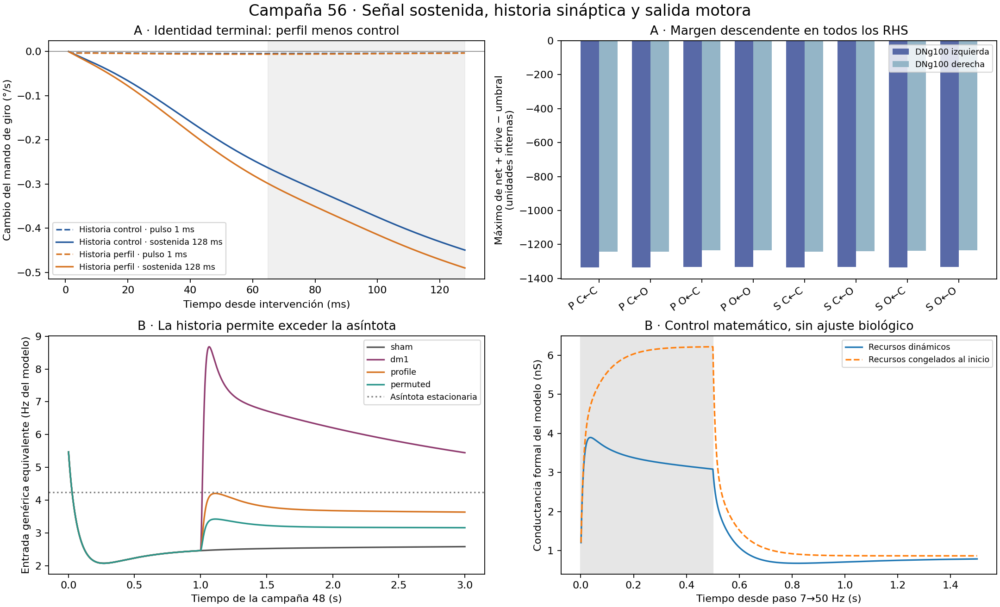

# Campaña 56 — transferencia temporal y mando

**Etapas 4 y 5 abiertas.** Esta ronda es un diagnóstico causal con dos instrumentos, no una prueba de navegación hacia una fuente ni de recuperación tras viento. La señal sensorial no se adapta a una fuente espacial en estos brazos.

## Resultado de la intervención sostenida

La persistencia supera el criterio diagnóstico en ambas historias. Clasificación del contraste A: **PROMETEDOR_NO_CONFIRMADO**, restringida a la suficiencia de esta intervención y esta preparación.

Sostener 128 ms la misma muestra también aumenta la exposición acumulada frente al pulso de 1 ms. Este diseño comprueba el efecto de duración, pero no separa una integración ordinaria de una memoria temporal especializada. En estos brazos la entrada ORN está en basal: no demuestra que una salida PN natural bajo olor mantenido sea demasiado breve. El signo es un cambio respecto de control; no indica que el giro apunte hacia una fuente.

Dos historias de receptor × dos identidades terminales reales × dos duraciones: ocho brazos de 128 ms, más dos cualificaciones de 2 ms. El pulso actúa sólo el primer ms y la intervención sostenida actúa los 128 ms. Ambos usan el mismo escritor sobre 686 salidas PN consumidas por la suma genérica. Las rutas especializadas quedan con su señal nativa. La fuente fijada es una muestra inicial real, no una reproducción completa de su trayectoria natural. No se cambian pesos, umbrales ni lectores.

Ventana primaria congelada: 65–128 ms. Cada efecto es fuente perfil menos fuente control, manteniendo la historia receptora. La interacción es efecto sostenido menos efecto pulso. El target DNg por ms usa la cuarta RHS del último ensayo RK3(2) aceptado en un intervalo comprometido, evaluada en el límite izquierdo de la frontera; no se reevalúa después de ella.

| Historia receptora | Δ giro pulso (°/s) | Δ giro sostenido (°/s) | Interacción (°/s) | Cociente sostenido/pulso | Criterio conjunto DN/giro |
|---|---:|---:|---:|---:|---|
| Historia control | -0.0041357056 | -0.36170537 | -0.35756967 | 87.4592 | Sí |
| Historia perfil | -0.0050535968 | -0.40085563 | -0.39580204 | 79.3209 | Sí |

El criterio exige, por historia, interacción material tanto en DNb (1,6×10⁻⁵ q) como en giro (0,02°/s), mismo signo y al menos duplicación. Los valores y cada condición lógica se reconstruyen en `A_RESULTADOS.json`; no se seleccionan sólo las historias favorables.

**DNg100 conservó objetivo cero en todas las evaluaciones registradas.** Ninguna historia cumplió el criterio conjunto de cambio de avance y objetivo DNg100.

| Brazo | Objetivo DNg100 máximo | Avance medio 65–128 ms (mm/s) | Margen máximo izquierda / derecha |
|---|---:|---:|---|
| pulse_sham_from_sham | 0 | 0 | -1335.319 / -1242.013 |
| pulse_sham_from_profile | 0 | 0 | -1335.208 / -1241.884 |
| pulse_profile_from_sham | 0 | 0 | -1331.868 / -1234.914 |
| pulse_profile_from_profile | 0 | 0 | -1331.76 / -1234.787 |
| hold_sham_from_sham | 0 | 0 | -1335.303 / -1241.993 |
| hold_sham_from_profile | 0 | 0 | -1332.316 / -1238.533 |
| hold_profile_from_sham | 0 | 0 | -1334.378 / -1237.809 |
| hold_profile_from_profile | 0 | 0 | -1331.469 / -1234.439 |

Las fuentes difieren en 586/686 terminales. El contraste L2 es 3.63956% respecto de control y 3.60623% respecto de perfil. Se informa aunque sea pequeño; 56 no incorpora la antigua puerta del 1%, y no cambia retrospectivamente el veredicto de 55.

## Transferencia sensorial e historia

B reutiliza 3 s por condición de 48 y resuelve las ecuaciones existentes con una solución analítica. Los 16 contrastes contra DOP853 dieron error máximo 3.1918701e-10 (tolerancia previa 10⁻⁸). El control congela recursos desde el inicio, con basal y estado inicial emparejados; no iguala el pico posterior. No se ajustaron parámetros a estos resultados.

| Registro 48, últimos 500 ms | ORN q·cap medio (Hz del modelo) | Puente genérico equivalente (Hz del modelo) | Recurso rápido | Recurso lento |
|---|---:|---:|---:|---:|
| sham | 9 | 2.5753 | 0.324362 | 0.237374 |
| dm1 | 50.8335 | 5.61178 | 0.0783585 | 0.149311 |
| profile | 17.9216 | 3.64447 | 0.194328 | 0.214665 |
| permuted | 13.9223 | 3.16222 | 0.252135 | 0.224918 |

La asíntota a tasa constante es 4.2339089 Hz equivalentes. **No es una cota transitoria ni una tasa de PN.** La entrada DM1 registrada puede superarla porque conserva historia. Esto demuestra compresión en las ecuaciones actuales, sin demostrar exceso de depresión fisiológica.

La revisión de Motor no encontró una segunda normalización de población en el tramo inspeccionado. También confirmó que las salidas finas y genéricas tienen consumidores diferentes y que el estímulo prescrito sustituye explícitamente el objetivo periférico ORN. Los datos biológicos temporalmente emparejados para validar esa transferencia siguen pendientes. Véanse `aporte_motor/FRONTERA.md` y `FUENTES_Y_DECISIONES.md`.

## Integridad y coste

1028 ms CNS intentados y comprometidos medidos en la cola reparada; cargo conservador total 1030 ms. CPU de trabajadores medida: 2827.357 s; cargo con el primer fallo: 2997.357 s. Colas: 2654.769 s. Topes previos: 1200 ms CNS, 6000 s CPU y 5000 s de cola.

La primera cualificación falló al escribir caracteres Unicode antes del primer paso CNS. No es un negativo neural. Se conservaron log y archivos parciales; se cobró la reserva completa de 170 s CPU y 2 ms CNS porque no había cierre cronometrado. La reparación sólo impone UTF-8 en metadatos. Dos nuevas cualificaciones reprodujeron exactamente la referencia antes de los ocho brazos.

El verificador reconstruye lectores, relojes, contexto RHS, identidad de terminales, intervención consumida, márgenes, objetivos y presupuesto. Rechazó 16 corrupciones deliberadas bajo Python optimizado. CPU de verificación: 5.712 s. El banco B consumió 4.168 s CPU; no repitió 48.

No hay semillas nuevas ni confirmación ciega: son dos historias del mismo preparado expuesto. Las cualificaciones comprueban transparencia instrumental, no equivalencia biológica. Los archivos completos conservan estados y fuentes; la reproducción limpia del paquete compacto recalcula los registros y el banco CPU, no vuelve a simular el cerebro. El cierre y la publicación tienen recibos separados.

## Decisión y siguiente discriminador

Conservar A como señal causal prometedora para comprobar persistencia natural y alcance de consumidores, sin promoverla a navegación.

Mantener tres alternativas diferenciadas: **A**, ruta y persistencia natural de salida PN; **B**, transferencia ORN→PN con datos y observables emparejados; **C**, estado descendente e iniciación locomotora. Priorizar el discriminador que cambie una decisión de mecanismo, antes de otra vida larga o de integrar patas. No ajustar neuronas una a una, cambiar el lector por selección de un positivo ni aumentar ganancias para forzar un PASS. El siguiente contrato deberá delimitar dos instrumentos como máximo y un presupuesto nuevo antes de ejecutar.

La admisión de 4 requiere orientación útil con controles causales pertinentes y la de 5 requiere perturbación y recuperación. Una activación externa de terminales no sustituye esos resultados. La posibilidad de lograrlos sigue siendo una hipótesis experimental; este diagnóstico no prueba imposibilidad ni garantiza éxito.

La priorización posterior y el contraste con los asesores quedan en [DECISION.md](DECISION.md).
