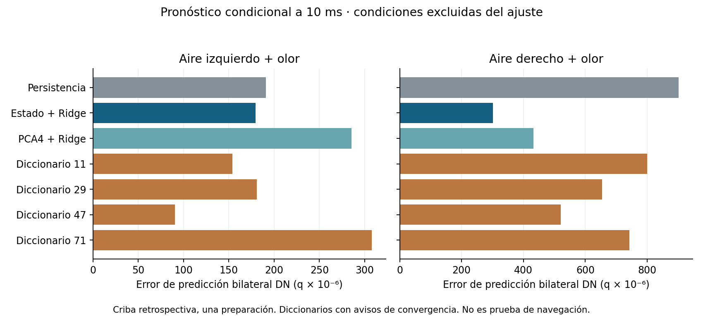

# Qué falta para avanzar en las etapas 4/5

**Prioridad: mejorar la observación causal y cerrar la interfaz física. No está demostrado que falte un SAE, una ley celular concreta o más datos en general.** La investigación consultó a ChatGPT ASTRA_V2, ChatGPT_Motor_V2 y Motor C++/CUDA; cada uno propuso tres alternativas antes del contraste. La terna propia también quedó registrada. No se crearon subagentes ni se atribuye modo PRO verificado.

## Dos comprobaciones ejecutadas

**1. Cobertura insuficiente del registro temporal.** De 1314 descendentes anotadas, sólo 12 tenían q registrada cada ms en51. En el contraste aire izquierdo−derecho sin olor, al final de90ms, 532 presentan |Δq|>10⁻⁶; **529 de ellas no tienen trayectoria temporal guardada**. El umbral es descriptivo, no una tolerancia numérica ni un criterio de navegación. El efecto todavía mezcla configuración/dosis y el error de unidades. No identifica neuronas de giro; sí demuestra que el panel seleccionado deja muchas respuestas sin describir. [Datos y verificador](aporte_motor/INFORME.md).

**2. Dictionary Learning frente a métodos simples.** Se ajustó sobre cuatro condiciones parentales de51, excluyendo las dos combinaciones aire+olor. Predice q10ms después a partir del estado observado y las entradas presentes; no es una trayectoria libre desde el checkpoint. Los datos ya estaban expuestos y conservan el error de unidades51. Hay una sola preparación, no420 animales independientes. No se mezclaron G/I ni campañas de leyes distintas.

Error bilateral DNb05 en unidades q×10⁻⁶; menor es mejor:

| Instrumento externo | Izquierda + olor | Derecha + olor |
|---|---:|---:|
| Persistencia | 191.018 | 901.265 |
| Estado + Ridge | 179.260 | 301.354 |
| PCA4 + Ridge | 285.182 | 432.076 |
| Diccionario 11 | 154.105 | 799.772 |
| Diccionario 29 | 180.758 | 654.479 |
| Diccionario 47 | 90.670 | 520.909 |
| Diccionario 71 | 307.766 | 742.014 |

El diccionario no cumple el criterio previo de mejorar al mejor control en ambas condiciones y en las cuatro inicializaciones sin regresión global. El cálculo consumió **1.099sCPU**; la reejecución en el mismo entorno bajo `-O` coincidió exactamente. Las cuatro variantes de diccionario emitieron avisos de convergencia de la optimización: el negativo pertenece a **esta configuración y presupuesto**, no demuestra que un SAE bien entrenado sea inútil. No se reajustó para cambiar la decisión.

La reconstrucción de q mejora frente a PCA4, pero esa mejora no se traduce en mejor pronóstico bilateral en ambas condiciones. Los tamaños tampoco son idénticos: PCA usa64 coeficientes de base y el diccionario512, con cuatro coeficientes activos por muestra. Todo ello queda registrado. **No adoptar hoy este diccionario; mantener Ridge como referencia externa, aún sin validez para escoger intervenciones causales.** El clasificador mecánico `DESCARTADO_EN_ESTA_CRIBA` no descarta la familia de representaciones dispersas.

## Alternativas contrastadas y decisión

| Opción | Qué permitiría descubrir | Estado / siguiente discriminador |
|---|---|---|
| Escáner causal por puertos y poblaciones | Dónde se modifica o pierde una perturbación realmente consumida | Prioridad inmediata: reparar unidades, cualificar el observador y repetir los brazos afectados. Registrar todas las DN y fronteras sensoriales, sin escoger por ranking. Después una intervención finita valida la ruta propuesta. |
| Predictor dinámico y calibración fisiológica | Si el fallo depende de memoria/estado, excitabilidad o transferencia | Reutilizar ARX/DMDc, controles físicos y Jaxley/SBI locales cuando haya datos compatibles. Exigir condición e historia excluidas del ajuste; no convertir el predictor en controlador. |
| Diccionario/SAE y otras representaciones poblacionales | Si una combinación distribuida aporta una descripción más útil que células o PCA | Criba pequeña ejecutada, sin ventaja robusta. Reconsiderar sólo con una pregunta, cobertura y validación causal que lo justifiquen; no entrenar uno grande por analogía con Claude. |

Hay datos reales disponibles, pero sus dominios importan. Suver2019 ya está local; no se descargaron sus9,48GB otra vez. Jaxley y SBI ya tienen pruebas técnicas locales, no identificación biológica completa. Se recuperó únicamente el README de Kathman2026 (9.511bytes), que describe imagen y conducta sincronizadas: permite seleccionar después un subconjunto para estudiar persistencia tras retirar olor. No se adquirió su archivo completo ni se integró su política de navegación programada.

## El adjunto de Anthropic

Es parcialmente verdadero y exagera algunas conclusiones. Dictionary Learning, J-space (julio2026) y el estudio de171conceptos emocionales (abril2026) son reales. Los171conceptos se eligieron previamente; no son171emociones humanas descubiertas. Los rasgos de un diccionario no quedan garantizados como independientes y las neuronas individuales no son inútiles. [Verificación y fuentes primarias](FUENTES_Y_ADJUNTO.md).

## Cómo continúa el proyecto

La decisión operativa está en [PLAN_CONTINUACION.md](PLAN_CONTINUACION.md): reparar y medir antes de cambiar otra ley global; mantener las hipótesis de interfaz, transmisión/estado y propiocepción, con máximo dos prototipos completos por ronda. Se corrigió el asesoramiento que trataba JO→PN como una cadena obligatoria. Aire y olor tienen ramas distintas cuya convergencia hay que comprobar.

**Etapa4:** falta demostrar orientación útil dependiente de información online frente a controles pertinentes. **Etapa5:** falta recuperación tras una perturbación física reservada. Un escáner, una neurona activa o una predicción acertada no sustituyen esas pruebas. Es razonable continuar investigando; todavía no hay evidencia que garantice superar ambas etapas con el preparado actual.

## Reproducción y límites

Entorno del ajuste: Python3.10, NumPy1.26.4, scikit-learn1.7.2. Verificación corta: `python -O verificar_criba.py`; recalcula métricas y decisiones desde arrays y detecta seis corrupciones. `python -O aporte_motor/verify_projection.py` reproduce los conteos y cuatro corrupciones. Reproducción del ajuste: `python -O criba_instrumentos.py --verify` con las versiones indicadas. No carga fuentes externas al paquete ni ejecuta CNS. Las comprobaciones de hashes deben hacerse antes de ejecutar el verificador de Motor, que escribe su recibo local.

Presupuesto de esta investigación:120sCPU instrumental,0CNS/GPU,2GiBRAM,100MiB nuevos y25min de revisión activa; asesor local con tope25sCPU. El ajuste principal consumió1,10s y su repetición1,12s; Motor informó1,088sCPU en sus cribas/exportación/verificador. Estas cifras no incluyen todas las lecturas auxiliares ni el razonamiento remoto. Se conservaron los avisos de optimización y los resultados negativos. Motivo de cierre: hito de comparación de herramientas, cobertura y plan concreto completo. No se ha ejecutado la reparación CNS51 ni se inició una simulación de etapas4/5 en esta consulta.
